# Polluxa / CRM Ads — Current-State Technical Architecture Document

**Audience**: senior engineers onboarding onto this codebase.
**Scope**: the entire repo as it exists today, verified file-by-file (not inferred). Where `docs/architecture-roadmap.md` describes a *target* architecture, this document describes *what is actually running* — and several claims in that roadmap are now out of date (Postgres, Redis/BullMQ, and three of the five target services already exist). Deltas are called out inline in §16/§18.

---

## 0. Executive Summary

Polluxa (product-facing name "CRM Ads") is an AI-driven ad-campaign automation platform: a business connects Meta/Google ad accounts, Polluxa scrapes their website, runs an AI research pipeline (product/audience/competitor/market/persona analysis), generates a media strategy and campaign creative (copy + AI image + optional AI video), and launches/optimizes real ad campaigns — with an AI chat "Strategist" and a separate "Copilot" for ongoing account management.

It is **not** a single monolith and **not** a fully-separated microservice fleet — it's a **hybrid**: one Express "gateway" process owns most business logic and the Prisma/Postgres connection; three sibling processes (`auth-service`, `campaign-service`, `scraper-service`) run independently but **import gateway service-layer code directly via relative TypeScript imports**, not over HTTP. Five more standalone Node processes are BullMQ workers. One Python FastAPI sidecar exists purely as a no-API-key research fallback. Nothing is containerized for deployment (Docker Compose exists, but only to provision local Postgres/Redis — there is no Dockerfile for any app).

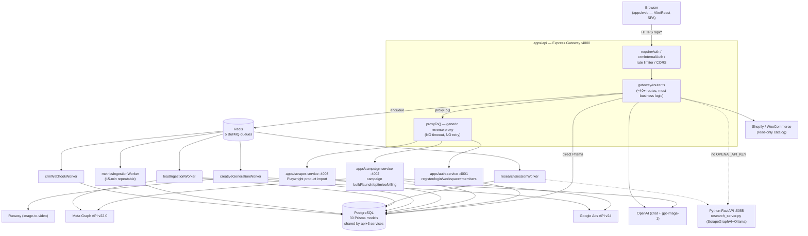

---

## 1. High-Level Architecture

### 1.1 Overall architecture

Five deployable units, plus one optional sidecar:

| Process | Port (env var) | Role | Owns Prisma client? |
|---|---|---|---|
| `apps/web` | 5173 (Vite dev) | React SPA | no (browser-side, talks HTTP only) |
| `apps/api` | 4000 (`PORT`) | Gateway + most business logic | yes — schema source of truth |
| `apps/auth-service` | 4001 (`AUTH_SERVICE_PORT`) | Register/login/Google-auth, workspace + membership CRUD | imports `apps/api/src/modules/auth`, `.../workspace` directly |
| `apps/campaign-service` | 4002 (`CAMPAIGN_SERVICE_PORT`) | Campaign build/launch/optimize, billing | imports `apps/api/src/modules/orchestrator`, `.../pipeline`, `.../optimization`, `.../insights`, `.../billing`, `.../strategy`, `.../onboarding/researchSessionService` directly |
| `apps/scraper-service` | 4003 (`SCRAPER_SERVICE_PORT`) | Playwright product-import pipeline | own Prisma import for its own writes |
| `apps/scraper-service/python` | 5055 | ScrapeGraphAI/Ollama research fallback (only used when `OPENAI_API_KEY` unset) | no (stateless HTTP call) |
| 5× BullMQ workers (`apps/api/src/workers/*`) | n/a | Async job processing | yes |

**This is the single most important architectural fact to internalize**: `auth-service` and `campaign-service` are **not** independently-deployable microservices in the normal sense — they are separate Node *processes* that share the exact same TypeScript source tree as `apps/api` via `../../api/src/modules/...` relative imports (confirmed in both `apps/auth-service/src/index.ts` and `apps/campaign-service/src/index.ts`). They cannot be deployed from a different repo or built independently of `apps/api`'s source being present alongside them. This is a deliberate, documented "roadmap Phase 2" mid-point: logically separated by network boundary and by their own `internalServiceAuth` gate, but still monorepo-coupled at the code level. `scraper-service` is more genuinely independent (its own Playwright pipeline, own service-local modules), only reaching into `apps/api` for its own Prisma client / a couple of shared types.

### 1.2 Request flow (synchronous path)

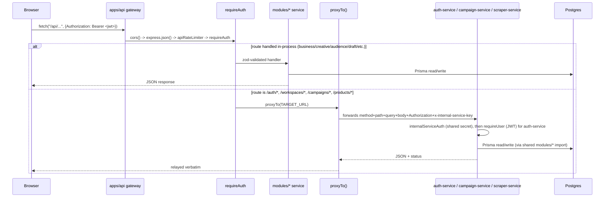

Two independent auth checks exist on any proxied `auth-service` route (defense in depth added this session): the gateway's `requireAuth` (JWT signature check, with a **dev-mode bypass** — see §13) and `auth-service`'s own `requireUser` + per-route workspace-membership/role check. `campaign-service` and `scraper-service` only get `internalServiceAuth` (shared-secret check that the call came from the gateway) — they have **no independent per-user auth check**, so a compromised or misconfigured gateway is a single point of failure for those two services' authorization.

### 1.3 Async/event flow

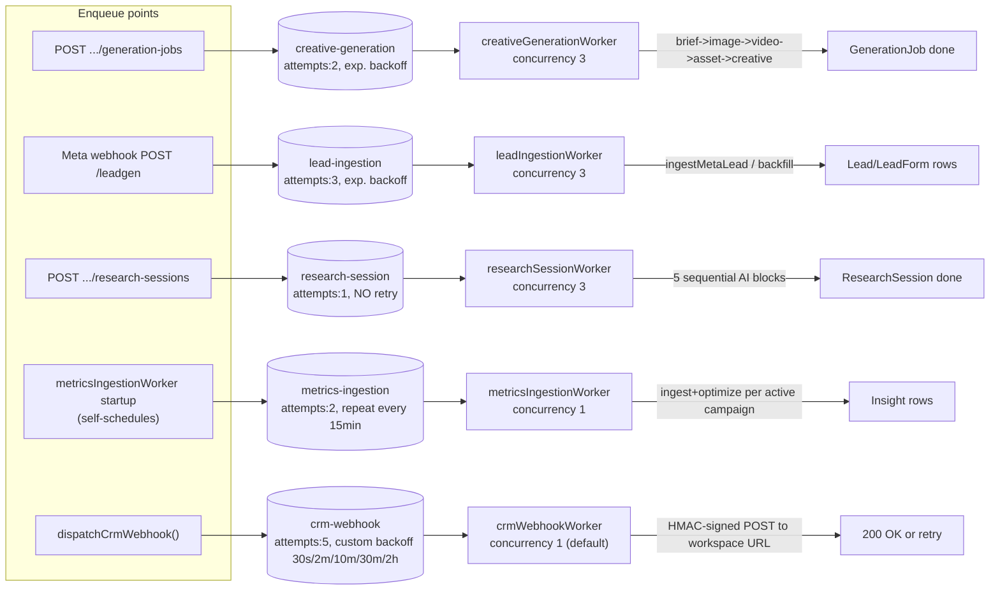

A **separate, unrelated** in-process event mechanism also exists: `apps/api/src/infra/eventBus.ts` (`InMemoryEventBus`, a thin `EventEmitter` wrapper). `registerEventHandlers()` (called once at gateway startup) subscribes exactly one handler to `"campaign.launched"`, which today only logs. The only publisher is `campaignOrchestrator.launchCampaign()`. This is explicitly documented in-code as a placeholder for a future Kafka-backed bus (see `docs/architecture-roadmap.md` Phase 3) — it has **no persistence, no cross-process delivery, and is not related to the Redis/BullMQ queues above**.

### 1.4 Module boundaries

- **Gateway (`apps/api/src/gateway/`)**: HTTP concerns only — routing, zod validation, auth middleware, proxying. Should not contain business logic (mostly doesn't — `router.ts` handlers are thin, delegating to `modules/*`).
- **Service layer (`apps/api/src/modules/*`)**: ~25 modules, each a folder with one or more `*Service.ts`/`*Engine.ts` files exporting plain async functions (no classes, no DI container). This is the actual business logic and is what `auth-service`/`campaign-service` import directly.
- **Infra (`apps/api/src/infra/*`)**: cross-cutting technical concerns — `prisma.ts` (client singleton), `queue.ts` (BullMQ definitions), `openaiClient.ts`, `eventBus.ts`, `analyticsStore.ts`, `objectStorage.ts` (local-disk placeholder), `vectorStore.ts` (in-memory placeholder), `crypto.ts` (AES-256-GCM token encryption).
- **Workers (`apps/api/src/workers/*`)**: standalone entry points, each `new Worker(queueName, processor, opts)` — no shared worker-runtime abstraction, each file duplicates its own `Worker` construction.

### 1.5 Data flow

Almost every domain model in Postgres stores its actual payload as an opaque `data Json` column rather than normalized relational columns (documented in the schema file's own header comment as a deliberate SQLite→Postgres "driver swap, not a redesign"). Only **3 real Prisma `@relation` foreign keys exist in the entire 30-model schema**: `WorkspaceMember→Workspace`, `Lead→LeadForm`, `Lead→Contact`. Every other cross-entity reference (`businessId`, `campaignId`, `workspaceId` on most models, `adId`, etc.) is a plain indexed string column with **no enforced foreign key** — referential integrity is 100% application-level. See §5 for the full schema and the implications of this.

### 1.6 Sequence of operations — illustrative end-to-end example

`POST /api/campaigns/:id/launch` (a campaign-service-proxied route):

1. Browser → gateway, `Authorization: Bearer <jwt>`.
2. Gateway middleware: `cors()` → `express.json()` (with raw-body capture for the unrelated Meta-webhook HMAC use) → `apiRateLimiter` (600 req/min/IP) → `requireAuth` (JWT signature check; **no-op if header absent and `NODE_ENV !== "production"`** — see §13).
3. Gateway's `router.ts` line for this path is `campaignProxy` → `proxyTo(CAMPAIGN_SERVICE_URL)` — a raw `fetch` with **no timeout, no retry** (flagged repeatedly by research as the single most consistent gap in this codebase's otherwise-decent defensive patterns).
4. `campaign-service`: `internalServiceAuth` checks `x-internal-service-key`, then the route handler calls `campaignOrchestrator.launchCampaign(campaignId, workspaceId)` — imported directly from `apps/api/src/modules/orchestrator/campaignOrchestrator.js`.
5. `launchCampaign` splits variants by network, calls `launchMetaHierarchy`/`launchGoogleHierarchy` (private) which build the real Campaign→AdSet→Creative→Ad object graph against the live Meta/Google APIs (or return mocked IDs if no live credentials), each individual step wrapped in try/catch that marks that *variant* failed and **continues** (no rollback of partially-created ad-platform objects).
6. On success, publishes `"campaign.launched"` on the in-process `InMemoryEventBus` (logged only, no other consumer today).
7. Response relayed back through `proxyTo()` to the browser verbatim.

---

## 2. Folder Structure

```
Dev-Goads/
├── apps/
│   ├── web/                    React 18 + Vite SPA
│   ├── api/                    Express gateway — schema owner, most business logic
│   ├── auth-service/           Standalone process, imports apps/api modules directly
│   ├── campaign-service/       Standalone process, imports apps/api modules directly
│   └── scraper-service/        Standalone process + Python sidecar
├── docs/                       architecture-roadmap.md (stale target-state doc), meta-app-review.md
├── docker-compose.yml          Postgres + Redis ONLY — no app containers
├── .github/workflows/ci.yml    typecheck+build for api and web
└── (root package.json — npm workspaces)
```

### `apps/web/` — Frontend SPA

- **Purpose**: the entire user-facing product.
- **Responsibilities**: routing, all UI, client-side validation, calling the gateway's `/api/*` surface exclusively (never talks to auth-service/campaign-service/scraper-service directly).
- **Dependencies**: `react-router-dom`, no state-management library (two Context providers only), a single hand-written `fetch` wrapper (`src/api/client.ts`) — no React Query/SWR/Axios.
- **Design quality**: pragmatic and consistent (every page follows the same `useState`/`useEffect`-on-mount/`try-catch-setError` pattern), but this consistency is also a scaling limitation — see §4 and §14 (no request caching/de-duplication anywhere means every page navigation re-fetches from scratch, and there is no optimistic-update layer).

### `apps/api/` — Gateway

```
src/
├── index.ts                 Express app bootstrap, middleware order, route mounting
├── gateway/
│   ├── router.ts             ~900 lines, ~50+ routes, the majority of the HTTP surface
│   ├── proxy.ts               proxyTo() — generic reverse proxy (no timeout/retry)
│   ├── asyncHandler.ts, errorResponse.ts
│   ├── metaOAuthRoutes.ts, googleOAuthRoutes.ts, metaLeadWebhookRoutes.ts, adsDataRoutes.ts
│   └── middleware/            auth.ts (requireAuth), crmInternalAuth.ts, rateLimit.ts
├── modules/                   ~25 folders, one per bounded business concern (see §3)
├── workers/                   5 standalone BullMQ consumer processes
├── infra/                     prisma.ts, queue.ts, openaiClient.ts, eventBus.ts, crypto.ts,
│                               objectStorage.ts (local disk), vectorStore.ts (in-memory), analyticsStore.ts
├── db/                        Prisma client wiring
└── test/                      ~20 test files, mixed unit + ".live.test.ts" (many still fetch-mocked)
prisma/
├── schema.prisma              30 models, 9 migrations
└── migrations/
```

**Design quality**: `router.ts` at ~900 lines mixing zod schemas inline with handlers for ~50 routes is the weakest structural point — it works, but it's a single file every new resource area has to be appended to (I added 7 new resource areas to it this session; nothing about its structure discourages that pattern from continuing indefinitely). The `modules/*` split is genuinely good — small, single-responsibility files, consistent `{id, workspaceId, data: Json}` CRUD pattern, easy to find things.

### `apps/auth-service/`, `apps/campaign-service/`

```
src/
├── index.ts            All routes in one file (auth-service ~130 lines, campaign-service similar)
├── internalAuth.ts      Byte-for-byte identical shared-secret middleware (copy-pasted, not a shared package)
├── requireUser.ts       (auth-service only) JWT verification + req.userId
├── asyncHandler.ts, errorResponse.ts, loadEnv.ts   (loadEnv.ts loads apps/api/.env — "shares apps/api's .env rather than duplicating secrets")
```

**Dependencies**: both import `../../api/src/modules/...` directly — a real, load-bearing coupling, not a convenience. **Design quality**: functional but fragile — `internalAuth.ts` is duplicated identically in three places (auth-service, campaign-service, scraper-service) rather than a shared package; any future change (e.g., adding IP allowlisting) needs three synchronized edits.

### `apps/scraper-service/`

```
src/
├── index.ts, internalAuth.ts
├── scraping/browser.ts        shared chromium.launch() singleton, per-request isolated contexts
├── pipeline/                   scrapeWorker -> imageWorker -> productParser -> llmNormalizer ->
│                                vectorIndex -> creativeGenerator -> campaignSuggestions
python/
├── research_server.py         FastAPI + scrapegraphai + local Ollama model, port 5055
├── requirements.txt, smart_scraper_test.py
```

**Design quality**: the 7-stage pipeline is cleanly separated one-file-per-stage, each independently testable — the best-organized of the three sibling services. The Python sidecar is a reasonable pragmatic choice (Node has no first-class scrapegraphai equivalent) but is a second language/runtime to operate in production with no containerization yet.

### `docs/`

- `architecture-roadmap.md` — a **target-state** migration plan written at an earlier point in this project's life. **Materially out of date**: it states Postgres/Redis/BullMQ/service-extraction/CI don't exist — all five now do. Treat it as historical intent, not current fact; this document supersedes it for "what's actually there today."

---

## 3. Backend Architecture

### 3.1 Middleware stack (exact order, `apps/api/src/index.ts`)

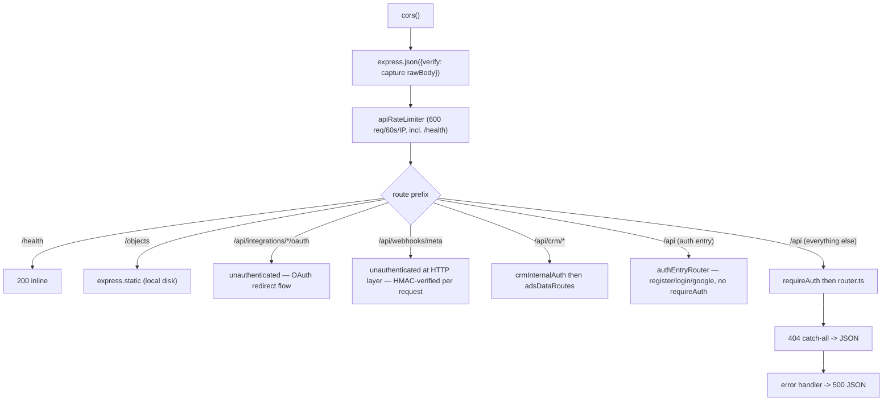

`register`/`login`/`google` are deliberately mounted **ahead of** `requireAuth` (a fix made this session) — a client has no bearer token yet when calling them, so gating them behind `requireAuth` would be a chicken-and-egg 401 in production.

### 3.2 Services (see §2 module list) — no controllers/services split

There is no separate "controller" layer distinct from route handlers — `router.ts` handlers *are* the controllers, thin and delegating immediately into `modules/*`. This is a reasonable choice at this scale (avoids an indirection layer with only one implementation), but means route handlers and zod schemas for ~50 endpoints all live in one 900-line file.

### 3.3 Routes — full resource-area inventory (`apps/api/src/gateway/router.ts`)

| Area | Representative routes | Backing module |
|---|---|---|
| Auth entry (unauthenticated) | `POST /auth/register\|login\|google` | proxied → auth-service |
| Auth (authenticated) | `GET/PATCH /auth/me` | proxied → auth-service |
| Workspaces | `GET/PATCH /workspaces/:id`, members CRUD | proxied → auth-service |
| Notifications | list/count/mark-read | `notifications/notificationService.ts` |
| Notification preferences | GET/PUT | `notifications/notificationPreferenceService.ts` |
| Assets | list/create/delete/tags/upload | `assets/assetService.ts` |
| AI Insights | list/generate/dismiss | `insights/insightService.ts` |
| Integrations | connect/disconnect/settings/manual-connect, Meta/Google account pickers | `integrations/*` |
| Saved Audiences | CRUD + reach-estimate | `audience/savedAudienceService.ts` + targeting mappers |
| CRM webhook config | GET/PUT/DELETE | `crm/crmWebhookService.ts` |
| Creative generation | POST job, GET job, product catalog | `generation/generationJobService.ts` |
| Drafts | CRUD, publish, schedule | `drafts/draftsService.ts` |
| Ad Sets / Ads | CRUD | `drafts/draftsService.ts` (shared file) |
| Businesses | CRUD, strategies, analytics, ad-insights, strategist chat | `business/`, `strategy/`, `analytics/`, `adInsights/`, `strategist/` |
| Creatives | CRUD, variations | `orchestrator/creativesService.ts` |
| Campaigns | mostly proxied → campaign-service; `/trend` handled locally | `analytics/analyticsService.ts` (trend only) |
| Onboarding | scrape, analyze-product, analyze-audience, deep-research | `onboarding/scraper.ts`, `onboarding/analysis.ts` |
| Research sessions | POST/GET (async, BullMQ-backed) | `onboarding/researchSessionService.ts` |
| Product import | proxied → scraper-service | n/a |
| Support tickets | GET/POST | `support/supportTicketService.ts` |
| RBAC matrix | GET/PUT | `admin/rbacService.ts` |
| Developer portal | webhooks CRUD, API key get/regenerate | `admin/developerPortalService.ts` |
| Payment method | GET/PUT (masked only) | `billing/paymentMethodService.ts` |
| Automation rules | CRUD | `automation/automationRuleService.ts` |
| Optimization goal | GET/PUT | `optimization/optimizationGoalService.ts` |
| Copilot chat | POST | `copilot/copilotService.ts` |

(The last seven rows were added this session — see the earlier turns in this conversation for the exact bug-fix and feature-build history.)

### 3.4 Workers, queues, schedulers — see §11 for full detail

### 3.5 Complete request lifecycle — two contrasting examples

**In-process (fast path)**: `POST /api/workspaces/:id/audiences` → `requireAuth` → zod `savedAudienceSchema.safeParse` → `savedAudienceService.createSavedAudience` → Prisma insert → 201. No proxy hop, no queue, single round trip.

**Proxied + async (slow path)**: `POST /api/workspaces/:id/generation-jobs` → `requireAuth` → zod validate → `generationJobService.createGenerationJob` (status `"queued"`) → `creativeGenerationQueue.add()` → **202 Accepted returned immediately** → separately, `creativeGenerationWorker` (its own process) picks up the job whenever Redis delivers it → brief generation (OpenAI) → image generation (OpenAI `gpt-image-1` via raw fetch) → optional video (Runway) → asset upload (local disk) → `createCreative` → job marked done. The browser polls `GET /generation-jobs/:id` separately to observe completion — there is no websocket/SSE push.

---

## 4. Frontend Architecture

### 4.1 Routing (`apps/web/src/App.tsx`)

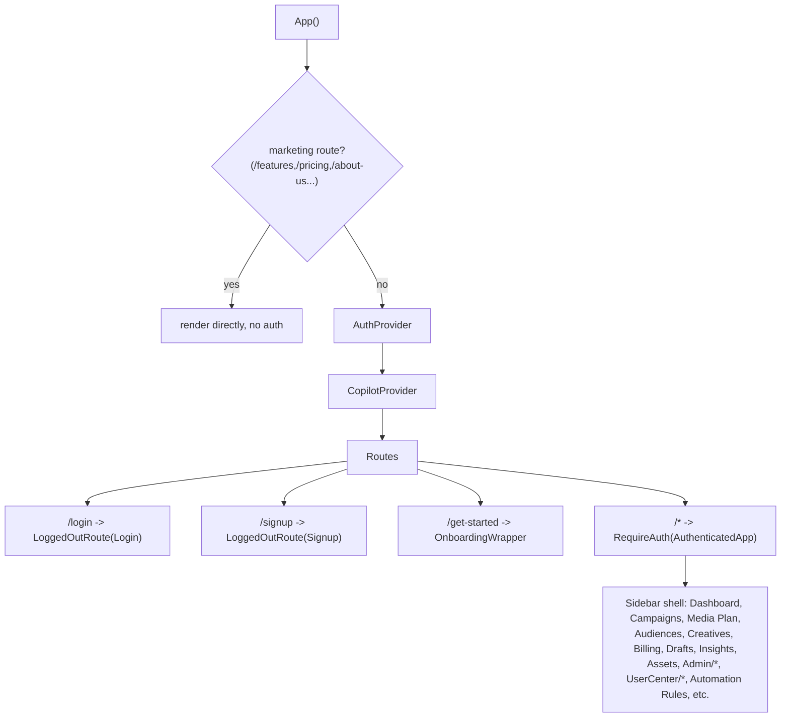

`RequireAuth` (added this session, replacing a hardcoded `isAuthenticated=true`) gates on real auth state: not authenticated → `/login`; authenticated but no `businessId` yet → `/get-started` (onboarding); otherwise renders the sidebar shell. `LoggedOutRoute` is the mirror image (already-authenticated users get bounced away from `/login`/`/signup`).

### 4.2 State management

Exactly two React Contexts, no Redux/Zustand/MobX:

- **`AuthContext`** (`src/context/AuthContext.tsx`): `user`, `workspace`, `workspaceId`, `businessId`, `isAuthenticated`, `login`/`signup`/`logout`. Backed by a bearer token in `localStorage` (`polluxa_token`), validated on mount via `GET /auth/me`.
- **`CopilotProvider`** (`src/providers/CopilotProvider.tsx`): the floating "AI Copilot" chat's own message history/status state, calls `api.chatWithCopilot`.

Everything else — every page's data, loading flag, error message, form fields — is local `useState`/`useEffect`. This is simple and consistent, but means: no shared cache (navigating away and back to a page always refetches), no request deduplication (two components mounting simultaneously and both wanting the same data both fetch independently), and no built-in retry/stale-while-revalidate behavior.

### 4.3 API communication (`src/api/client.ts`)

A single `request<T>()` wrapper around `fetch`: attaches `Authorization: Bearer <token>` only if a token exists (no auto-minted demo token as of this session's security fix), throws a normalized `Error` on non-OK responses (`extractErrorMessage` strips anything that looks like an internal stack trace/Prisma error before it reaches the UI — defense-in-depth against leaking backend internals). Every domain method (`api.listDrafts`, `api.chatWithCopilot`, etc.) is a one-line arrow function calling `request()` — roughly 90 methods in one file, mirroring the gateway's route inventory 1:1.

### 4.4 Loading flow / UI architecture

Universal per-page pattern:
```tsx
const [data, setData] = useState<T[]>([]);
const [loading, setLoading] = useState(true);
const [error, setError] = useState<string | null>(null);
useEffect(() => { load(); }, [deps]);
async function load() { setLoading(true); try { setData(await api.list(...)); } catch { setError(...); } finally { setLoading(false); } }
```
Component structure is one file per page under `src/pages/`, shared chrome (`PolluxaHeader`, sidebar) composed at the `AuthenticatedApp` level, a handful of shared components (`FormattedMessage` for markdown-lite AI-reply rendering, `HelpWidget`, `ErrorBoundary`, `CopilotDrawer`). No component library (no MUI/Chakra) — all hand-rolled CSS in one large `styles.css`.

---

## 5. Database

PostgreSQL via Prisma (`apps/api/prisma/schema.prisma`, 419 lines). **30 models**, evolved through 9 migrations (`20260703000000_init` → `20260709141126_add_mock_page_backends`).

### 5.1 Full model list

| Model | Table | Key fields beyond id/timestamps | Indexes |
|---|---|---|---|
| User | users | email(unique), passwordHash?, name, avatar?, googleId?(unique) | — |
| Workspace | workspaces | name, ownerId, plan, logoUrl?, timezone?, crmWebhookUrl?, crmWebhookSecret? | ownerId |
| WorkspaceMember | workspace_members | workspaceId→Workspace, userId (no FK), role, invitedAt, joinedAt? | workspaceId, userId |
| Business | businesses | workspaceId?, data:Json | workspaceId |
| Strategy | strategies | businessId, data:Json | businessId |
| Campaign | campaigns | businessId, workspaceId?, data:Json | businessId, workspaceId |
| AdSet | ad_sets | campaignId, workspaceId?, data:Json | campaignId, workspaceId |
| Ad | ads | adSetId, workspaceId?, data:Json | adSetId, workspaceId |
| Metric | metrics | campaignId, data:Json, date | campaignId |
| Invoice | invoices | businessId, data:Json | businessId |
| Creative | creatives | businessId?, workspaceId?, data:Json | businessId, workspaceId |
| Asset | assets | workspaceId, data:Json | workspaceId |
| Draft | drafts | workspaceId, data:Json | workspaceId |
| Insight | insights | workspaceId, data:Json | workspaceId |
| Integration | integrations | workspaceId, platform, data:Json | workspaceId, [workspaceId,platform] |
| Notification | notifications | workspaceId, data:Json | workspaceId |
| SavedAudience | saved_audiences | workspaceId, data:Json | workspaceId |
| GenerationJob | generation_jobs | workspaceId, businessId, type, status, input:Json, result:Json?, error? | workspaceId, businessId |
| LeadForm | lead_forms | workspaceId, platform, externalId, campaignId?, name, status, data:Json, leads[] | unique[workspaceId,platform,externalId], workspaceId, [workspaceId,platform] |
| Lead | leads | workspaceId, platform, externalId, leadFormId?→LeadForm, campaignId?, adId?, fullName?, email?, phone?, companyName?, status, submittedAt, data:Json, contactId?→Contact | unique[workspaceId,platform,externalId], [workspaceId,submittedAt], [workspaceId,platform], leadFormId, campaignId, email, contactId |
| Contact | contacts | workspaceId, email?, phone?, fullName?, companyName?, leadCount, firstSeenAt, lastSeenAt, leads[] | workspaceId, [workspaceId,email], [workspaceId,phone] |
| ResearchSession | research_sessions | workspaceId, businessId?, url, status, currentStep?, blocks:Json, personas:Json?, campaignSuggestions:Json?, result:Json?, error?, searchCount, cacheHit | workspaceId, url |
| SupportTicket | support_tickets | workspaceId, data:Json | workspaceId |
| NotificationPreference | notification_preferences | id=workspaceId, data:Json | — (PK only) |
| RbacRoleMatrix | rbac_role_matrices | id=workspaceId, data:Json | — |
| DeveloperWebhook | developer_webhooks | workspaceId, data:Json | workspaceId |
| DeveloperApiKey | developer_api_keys | id=workspaceId, key | — |
| PaymentMethod | payment_methods | workspaceId, data:Json (masked only — brand/last4/expiry, never a card number/CVC) | workspaceId |
| AutomationRule | automation_rules | workspaceId, data:Json | workspaceId |
| OptimizationGoal | optimization_goals | id=workspaceId, data:Json | — |

### 5.2 Relationships

**Only 3 enforced foreign keys in the entire schema**:
1. `WorkspaceMember.workspaceId → Workspace.id`
2. `Lead.leadFormId → LeadForm.id`
3. `Lead.contactId → Contact.id`

Everything else — `businessId` on Strategy/Campaign/Creative/Invoice/GenerationJob, `campaignId` on AdSet/Metric/LeadForm/Lead, `workspaceId` on nearly every model, `adSetId` on Ad — is a plain indexed string with **no database-level referential integrity**. `WorkspaceMember.userId` is deliberately *not* an FK to `User` either, since invites can target an email with no `User` row yet (`userId = "pending:<email>"`).

### 5.3 ER Diagram

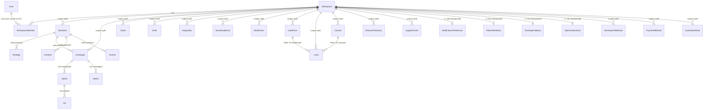

*(Diagram shows all 30 models' relationships; edges labeled "soft" are application-enforced only, per §5.2. This is annotated deliberately — a naive ER diagram implying enforced FKs everywhere would misrepresent the actual integrity guarantees a new engineer can rely on.)*

### 5.4 Constraints

Unique constraints: `User.email`, `User.googleId`, `LeadForm(workspaceId,platform,externalId)`, `Lead(workspaceId,platform,externalId)`. No `@@unique([workspaceId, platform])` on `Integration` despite the app assuming one row per platform per workspace — enforced only by application logic (`findFirst` before create), a soft gap.

---

## 6. AI Architecture

### 6.1 Infra layer (`apps/api/src/infra/openaiClient.ts`)

Three helpers over the `openai` npm SDK (v6.45.0), gated entirely on `OPENAI_API_KEY` presence (`openai` export is `null` otherwise — every single call site branches on this for a deterministic fallback):

- **`runStructured<T>`** — forces a single named tool-call (`tool_choice: {type:"function", function:{name}}`), returns parsed JSON or `null`. Model: `gpt-4o` always (no call site overrides it).
- **`runText`** — plain chat completion, free-text reply. Model: `gpt-4o`.
- **`runWebSearch`** — `gpt-4o-search-preview` with `web_search_options:{}`, extracts `url_citation` annotations.

### 6.2 Full pipeline inventory (13 distinct uses)

| Pipeline | File | Mode | Fallback when no key |
|---|---|---|---|
| Legacy onboarding analysis | `onboarding/analysis.ts` | runStructured ×2 | static `fallbackProductAnalysis`/`fallbackAudienceAnalysis` |
| Deep research (5 blocks) | `onboarding/marketResearch.ts` | runWebSearch→runStructured (×4 blocks) + runStructured-only (personas) | ScrapeGraphAI/Ollama sidecar → static fallback |
| Strategy generation | `strategy/strategyEngine.ts` | runStructured | `fallbackStrategy` |
| Campaign suggestions | `strategy/strategyEngine.ts` | runStructured, maxTokens 4096, forces 6 Meta+6 Google | `fallbackCampaignSuggestions` (deterministic angle-cycling) |
| Strategist chat | `strategist/strategistService.ts` | runText | static template |
| Copilot chat | `copilot/copilotService.ts` | runText | static template |
| Draft AI recommendation | `drafts/draftsService.ts` | runText, maxTokens 220 | swallowed — draft saves without one |
| AI Insights | `insights/insightService.ts` | runStructured, max 4 items | none — demo seed instead |
| Audience suggestions | `analytics/analyticsService.ts` | runStructured | 5 hardcoded personas |
| Creative brief | `generation/creativeGenerationService.ts` | runStructured | none surfaced |
| Creative variations | `orchestrator/creativesService.ts` | runStructured, exactly 3 | 3 hardcoded templates |
| Product-import LLM normalize | `scraper-service/pipeline/llmNormalizer.ts` | runStructured | passthrough raw draft |
| Product-import ad copy + campaign suggestion | `scraper-service/pipeline/creativeGenerator.ts`, `campaignSuggestions.ts` | runStructured | 1 generic variant / 1 generic suggestion |

**Not OpenAI, easy to mis-attribute**:
- Image generation (`generation/imageProvider.ts`) — raw `fetch` to `api.openai.com/v1/images/generations`, model **`gpt-image-1`** (OpenAI, but bypasses the chat-completions helpers entirely — a separate REST surface, no shared retry/timeout code with the rest of `openaiClient.ts`).
- Video generation (`generation/videoProvider.ts`) — **Runway**, `gen4_turbo`, entirely separate credential (`RUNWAY_API_KEY`).
- Campaign optimizer (`optimization/optimizationEngine.ts`) — **zero LLM involvement**, pure heuristic budget-reallocation logic.

### 6.3 Orchestration pattern

Every grounded pipeline follows the same shape: gather real account/business data (Prisma reads) → build a JSON context blob → either free-text (`runText`, chat features) or forced-schema (`runStructured`, anything feeding a UI form/downstream pipeline) → on `null`/missing-key, fall back to a deterministic static/heuristic response, always clearly tagged (`isDemo`/`dataSource`/`mock` field) so the frontend can distinguish real vs. placeholder data.

### 6.4 Deep research sequence (the most complex AI orchestration in the app)

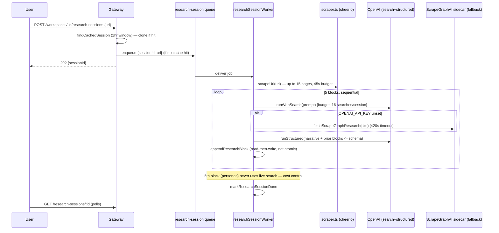

---

## 7. Scraping Architecture

Three genuinely distinct pipelines — do not conflate them:

### 7.1 Pipeline A — Onboarding site crawler (`apps/api/src/modules/onboarding/scraper.ts`)

Plain `fetch` + `cheerio`, no browser. Entry `scrapeUrl(url)`:
1. Fires a parallel, best-effort screenshot request to scraper-service's `/products/scrape` (12s timeout, never throws — this is the one point of coupling between Pipeline A and Pipeline B).
2. Fetches entry page (8s timeout), strips script/style/nav/footer, extracts title/description/headings/images (≤8, `og:image` preferred).
3. Discovers further pages via sitemap.xml → robots.txt's `Sitemap:` directive → same-origin homepage links, in that fallback order. **robots.txt `Disallow` rules are not honored** — only used to locate the sitemap.
4. Scores and crawls up to 15 pages total, **45-second wall-clock budget** for the whole crawl (breaks early, keeps partial results) — no per-domain rate limiting across concurrent onboarding submissions.
5. Concatenates into one excerpt (capped ~90KB), returns `ScrapedSite`.

### 7.2 Pipeline B — Product import (`apps/scraper-service`, Playwright)

Real headless Chromium (shared `browser` instance, per-request isolated `BrowserContext`s). 7 sequential stages:

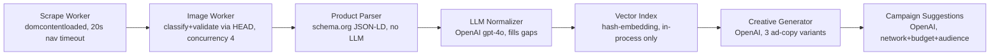

Notable: `page.waitForLoadState("networkidle")` is deliberately treated as best-effort/non-fatal (analytics widgets can keep connections open forever); captures both a JPEG screenshot and an accessibility-tree snapshot alongside raw HTML for the LLM stage to work from.

### 7.3 ScrapeGraphAI — confirmed present (initially assumed absent, verified via grep)

`apps/scraper-service/python/research_server.py` — FastAPI wrapping `scrapegraphai.graphs.SmartScraperGraph` against a **local Ollama model** (`llama3.2:latest` default), port 5055. This is exclusively the **no-`OPENAI_API_KEY` fallback path** for Pipeline C (deep research) — never used by Pipeline A or B. Sends the *already-scraped* excerpt rather than letting scrapegraphai re-fetch the URL itself (explicit code comment: re-fetching via scrapegraphai's own browser has been observed to hang indefinitely on JS-heavy sites). `SCRAPEGRAPH_TIMEOUT_MS = 420_000` (5 sequential local-model calls). A `blockUsable()` heuristic rejects outputs where ≥50% of fields look like placeholder junk ("na"/"unknown"/"tbd"), falling through to static fallback text as the final safety net — documented in-code as a real, observed quality gap versus the OpenAI path.

### 7.4 Structured extraction summary

| Concern | Pipeline A | Pipeline B |
|---|---|---|
| Browser | none (fetch only) | real headless Chromium |
| JS-rendered content | not visible | fully rendered |
| Structured data source | none — raw text/heading heuristics | schema.org JSON-LD (deterministic) + LLM gap-fill |
| Depth | up to 15 pages, sitemap-guided | single product page |
| Used by | onboarding flow, Pipeline C | product-import feature only |

---

## 8. External APIs

| Integration | Auth | API version | Token refresh | Retry | Rate-limit handling |
|---|---|---|---|---|---|
| **Meta Graph API** | OAuth (long-lived ~60d token) or manual paste | v22.0 (hardcoded, duplicated in 4 files) | **None** — long-lived tokens never refreshed/rotated | `fetchWithRetry` (3×, exp. backoff) in `metaAdapter.ts` only — OAuth/targeting calls use plain `fetch` | None |
| **Google Ads API** | OAuth (hourly access token + refresh token) | v24 | Yes — `getGoogleAdsCredentials()` proactively refreshes within a 2-min skew window | `fetchWithRetry` in `googleAdapter.ts`; **separate, inconsistent linear-backoff copy** in `googleLeadSyncService.ts`; OAuth/geo-target calls use plain `fetch` | None |
| **TikTok** | Static env-var token, **no OAuth, no per-workspace connect** | Business API v1.3 | n/a | `fetchWithRetry` | None |
| **Shopify** | Static admin API token | REST `2024-01` | n/a | **None** | None — single-page (50 items), silent truncation |
| **WooCommerce** | HTTP Basic (consumer key/secret) | REST v3 | n/a | **None** | None — same 50-item cap |
| **OpenAI (chat)** | API key | SDK v6.45.0, `gpt-4o` / `gpt-4o-search-preview` | n/a | None visible in `openaiClient.ts` | None |
| **OpenAI (images)** | API key, raw fetch (bypasses SDK helpers) | `gpt-image-1` | n/a | None | None |
| **Runway** | API key | `gen4_turbo`, image-to-video | n/a | None on any of its 3 fetch calls | None |
| **ScrapeGraphAI sidecar** | none (internal, localhost only) | n/a | n/a | negative-caching on failure (60s) | n/a |

**Cross-cutting finding**: retry/backoff exists only for the three *live-write* ad-network adapters (and inconsistently even there). It is absent from both OAuth token-exchange paths, both targeting mappers, both catalog adapters, the image provider, and all Runway calls. No code anywhere inspects a 429 status or `Retry-After`/Meta's `X-Business-Use-Case-Usage` rate-limit headers.

---

## 9. Current Research Pipeline (URL → Campaign → Frontend)

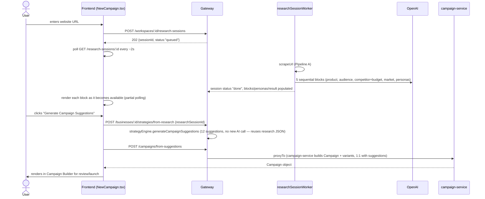

Key detail: `createStrategyFromResearch`/`createStrategyFromSuggestions` **deliberately make no new OpenAI call** — they reuse the already-gathered research JSON, explicitly to avoid double-spending real web searches on the same underlying data.

---

## 10. Current Campaign Generation Pipeline

| Sub-generation | Where | AI-driven? |
|---|---|---|
| **Audience** | `analyzeAudienceDeep` (research) feeds `mineAudiencePersonas` (4-6 personas); separately, `getAudienceSuggestions` (analyticsService) offers 5 segments in the standalone Audience Builder UI | Yes, both paths |
| **Competitor** | `analyzeCompetitorsAndBudget` — named competitors + differentiators via live web search | Yes |
| **Keyword** | Not a distinct step for Meta (interest taxonomy instead, resolved via Graph `/search?type=adinterest`); for Google, `googleTargetingMapper` turns `SavedAudience.interests` into **keywords** since Search campaigns target keywords not interest categories | Partially — keyword *choice* comes from the audience/persona step, not a separate keyword-research AI call |
| **Creative** | `generateCreativeBrief` (headline/body/CTA/imagePrompt) → `imageProvider` (OpenAI `gpt-image-1`) → optional `videoProvider` (Runway, image-to-video) | Yes (text + image); video is Runway not OpenAI |
| **Budget** | `analyzeCompetitorsAndBudget`'s explicit reasoning chain: product value → target CPA → conversion rate → clicks needed → blended CPC → recommended daily budget (shown to the user as `budgetReasoning[]`, a readable derivation, not just a number) | Yes |

The **audience-name string-matching bridge** is the one structurally fragile seam here: `AdStrategy.audiences` are free-text strings, not IDs. Both `metaTargetingMapper`/`googleTargetingMapper`'s `resolve*TargetingForWorkspace` functions do a case-insensitive name match against `SavedAudience` rows, silently falling back to a broad default (ages 18-65, US) on no match — workable, but a renamed SavedAudience or extra whitespace in a strategy's audience string silently loses real targeting with no error surfaced.

---

## 11. Background Jobs

### 11.1 Queues (`apps/api/src/infra/queue.ts`, Redis-backed)

| Queue | attempts | backoff | removeOnComplete | removeOnFail |
|---|---|---|---|---|
| `creative-generation` | 2 | exponential, 5000ms base | 24h | 7d |
| `lead-ingestion` | 3 | exponential, 5000ms base | 24h | 7d |
| `research-session` | **1 (no retry, by design)** | none | 24h | 7d |
| `metrics-ingestion` | 2 | exponential, 5000ms base | 24h | 7d |
| `crm-webhook` | 5 | custom: 30s/2m/10m/30m/2h | 24h | **30d** |

### 11.2 Workers (each its own Node process — confirmed via package.json `dev:*`/`start:*` scripts, no in-process worker spin-up anywhere in `index.ts`)

- **creativeGenerationWorker** — concurrency 3. `{jobId}` → load job → brief → image → optional video → asset → creative → done. Errors re-thrown after marking the job failed, so BullMQ's 2-attempt retry is real.
- **leadIngestionWorker** — concurrency 3. Job names `"ingest-one"` (single Meta lead, webhook-triggered) and `"backfill"` (full Page/Google resync). Unknown job names are logged and silently swallowed (not retried, not failed).
- **researchSessionWorker** — concurrency 3. Single sequential 5-block pipeline per session; **deliberately zero retries** — a partial run has already spent real, billed web searches, so silent retry would double-spend.
- **metricsIngestionWorker** — concurrency **1**. Self-registers a **repeatable job every 15 minutes** (`repeat: {every: 15*60*1000}`, fixed `jobId` for idempotent re-registration across restarts) that fans out `ingestCampaignMetrics` + `runOptimizationPass` + `recordOptimizationInsights` over every active campaign in a sequential `for` loop with a **per-campaign try/catch** — one broken campaign is logged and skipped, never blocking the rest, but also never retried (BullMQ's `attempts:2` essentially never engages for per-campaign failures).
- **crmWebhookWorker** — concurrency 1 (BullMQ default, not explicitly set). Re-reads webhook config at delivery time (so URL/secret rotation takes effect on retries), HMAC-SHA256 signs if a secret is configured, 5s hard timeout via `AbortSignal.timeout`. After 5 failed attempts, the job sits in BullMQ's Redis "failed" set for 30 days as the de facto dead-letter store — **no UI/table surfaces these**, only manual Redis inspection.

### 11.3 Schedulers

Exactly one: `metricsIngestionWorker`'s self-registered 15-minute repeatable job. No cron library, no external scheduler — pure BullMQ `repeat` option.

### 11.4 The separate in-process event bus

`infra/eventBus.ts` — `EventEmitter`-based, `publish()` fires handlers async via `Promise.resolve().then()` with error-swallowing `.catch`. One publisher (`"campaign.launched"`), one subscriber (logs only). Explicitly a placeholder for a future Kafka migration per the existing roadmap doc — **not** connected to Redis/BullMQ in any way.

---

## 12. Error Handling

- **Validation**: zod `safeParse` at nearly every route boundary in `router.ts`, returning `400 {error: parsed.error.flatten()}` on failure — consistent and good.
- **Not-found pattern**: two consistent shapes — explicit `if (!x) return res.status(404)` checks, or a service function `throw new Error("X not found")` caught by `sendError(res, err, 404, "Not found")`. `sendError` (`gateway/errorResponse.ts`) additionally intercepts genuine Prisma/infra errors and **forces them to a generic 500** regardless of the caller-requested status, specifically to avoid leaking DB internals to the client — a deliberate, good defensive pattern (also mirrored on the frontend's `extractErrorMessage`).
- **Retries**: BullMQ-level retry exists for 4 of 5 queues (see §11); HTTP-level retry (`fetchWithRetry`, 3× exponential) exists only in Meta/Google/TikTok adapters, inconsistently applied even within those files (OAuth/targeting calls in the same files often use plain `fetch`).
- **Failures that are silently swallowed rather than surfaced**: `draftsService.generateAiRecommendation` (draft saves without a recommendation, no error visible to user), `leadIngestionWorker`'s unknown-job-name branch, `metricsIngestionWorker`'s per-campaign catch, `crmWebhookWorker`/`dispatchCrmWebhook`'s no-op-on-missing-config (job "succeeds" while delivering nothing).
- **Logging**: a shared `logger` module used fairly consistently for errors; no structured/correlated request-ID tracing anywhere (see §13 Observability gap).

---

## 13. Security

### 13.1 What's solid (verified this session)

- Workspace membership + role checks now real (`auth-service`'s `requireUser` + `getMembership`/`MANAGE_ROLES` checks) — previously a full unauthenticated IDOR (any workspace readable/writable by anyone), fixed and re-verified live.
- `/api/auth/demo-token` (a JWT-mint-for-any-subject impersonation backdoor) removed entirely.
- Four copies of `internalServiceAuth`/`crmInternalAuth` now fail **closed** (500) rather than open (pass-through) if their shared secret env var is unset.
- Meta/Google OAuth tokens encrypted at rest (AES-256-GCM, `infra/crypto.ts`) before being stored in `Integration.settings`; `sanitizeIntegration()` strips all 5 known encrypted-token keys before any `Integration` is sent to the browser.
- Meta lead webhook verifies `X-Hub-Signature-256` via HMAC + `timingSafeEqual`.
- Payment method storage deliberately never persists a raw card number/CVC — only masked brand/last4/expiry, with server-side Luhn + expiry validation before accepting input.

### 13.2 Known, currently-accepted gaps

- **`requireAuth`'s dev-mode bypass**: missing `Authorization` header passes through as an anonymous `"demo"` identity whenever `NODE_ENV !== "production"` — by design ("dashboard works without a login flow" per the original comment), but means every gateway-local resource (businesses, creatives, drafts, assets, audiences — none of which have their own ownership checks either, per §3's module inventory) is fully open in any non-production environment. This is a much larger, deliberately out-of-scope-for-now issue than the workspace fix already made.
- **`JWT_SECRET` and other secrets default to hardcoded dev values** (`"dev-secret-change-me"`) if the env var is unset — `oauthState.ts`'s OAuth CSRF-state signing is one concrete instance; a production deploy that forgets to set this env var silently runs with a public, guessable secret.
- **Service-layer workspace-scoping is inconsistent** (per §3.5 research): `businessService`, `strategyEngine`, `creativesService`, `savedAudienceService`, `generationJobService` all expose bare-`id` getters/mutators with no ownership check at the service layer — any enforcement depends entirely on the route layer, which was not confirmed to consistently add it.
- **Meta long-lived tokens never rotate/refresh** — no expiry-driven re-auth trigger exists once the initial ~60-day token is issued.
- **No rate-limit-aware handling for any external API** (§8) — a burst of 429s from Meta/Google/OpenAI/Runway has no special handling beyond whatever generic retry exists.
- **`proxyTo()` has no timeout** — a hung `campaign-service`/`auth-service`/`scraper-service` call has no independent upper bound at the gateway.

---

## 14. Performance

Identified bottlenecks and inefficiencies (all confirmed via code, not assumed):

- **`notificationService.markAllRead`**: fetches every workspace notification into JS, then does one upsert *per unread row* in a loop — no batched `UPDATE ... WHERE`. Documented in-code as a SQLite-legacy workaround never migrated to a proper Postgres `read` boolean column + bulk update.
- **`notificationService.unreadCount`**: loads all (capped 50) notifications and filters in JS instead of a `COUNT` query.
- **`analyticsService.getAnalyticsSummary`** for `"week"`/`"month"` periods: re-derives spend/impressions/clicks/conversions from raw per-day metrics per campaign (O(campaigns × days)), a separate, naive re-implementation of what `normalizePerformance` already computes for the `"all"` case.
- **`metaLeadSync.resolveWorkspaceIdForMetaPage`**: linear-scans **every** `meta`-platform `Integration` row on **every inbound webhook delivery** to find the matching `pageId` — O(n) in total connected Meta integrations, correct at current scale, a real bottleneck once there are many workspaces.
- **`metricsIngestionWorker`**: sequential `for` loop over all active campaigns, concurrency 1, no batching/parallelism — a 15-minute tick will eventually take longer than 15 minutes as campaign count grows, queueing ticks up behind each other with no alerting.
- **Frontend has zero request caching/deduplication** — every page mount re-fetches from scratch; two components wanting the same data both fetch independently (no React Query/SWR).
- **`Json` blob storage on ~25 of 30 models** means most filtering happens in JS after a broad Prisma read (e.g., `listActiveCampaigns`'s Postgres JSON-path filter is one of the few pushed-down exceptions) rather than indexed relational columns.
- **In-memory vector store, in-memory event bus** — both explicitly placeholders; neither survives a process restart or works across multiple gateway replicas (see §15).

---

## 15. Scalability

Honest, load-bearing-architecture-driven answer per tier:

| Users | Verdict | Why |
|---|---|---|
| **100** | ✅ Fine as-is | Single Postgres + single Redis handle this trivially; in-memory vector store/event bus are non-issues at this volume; the O(n) Meta-webhook workspace lookup is negligible. |
| **1,000** | ✅ Mostly fine, minor cleanup recommended | `markAllRead`'s per-row loop and the week/month analytics re-derivation start to show as measurable (not critical) latency; still single-instance-safe since nothing yet requires horizontal scale-out. |
| **10,000** | ⚠️ Needs real work first | **The in-memory vector store and in-memory event bus become correctness bugs, not just performance ones**, the moment the gateway runs more than one replica (each replica has its own independent, empty vector index / event subscribers — data written on replica A is invisible on replica B). `metricsIngestionWorker`'s single-concurrency sequential fan-out is a real risk of ticks overlapping/backing up. The `proxyTo()` no-timeout gap becomes a real cascading-failure risk under load. Requires: horizontal-scale-safe replacement for the vector store (a real vector DB) and event bus (Redis pub/sub minimum, Kafka per the existing roadmap), and either sharding or parallelizing the metrics-ingestion fan-out. |
| **100,000** | ❌ Not without the Phase 3/4 roadmap items | Needs everything in the 10,000-tier fix, **plus**: the `Json`-blob-per-model schema stops being adequate for the query patterns a large customer base needs (analytics/reporting at this scale wants real columnar/relational structure, not JS-side filtering of Postgres JSON blobs); local-disk object storage (`objectStorage.ts`) doesn't survive a multi-instance deployment at all; no CDN/caching layer exists for the frontend or generated creative assets; no connection pooling strategy is evident for Prisma across what would need to be many gateway/worker replicas. This tier requires executing meaningfully through the existing `docs/architecture-roadmap.md` Phase 3-4 (event bus, specialized data stores) — the current architecture was never designed past "one of everything." |

---

## 16. Missing Components (for a production AI SaaS)

Confirmed absent by direct search, not assumed:

- **No payment processor** (Stripe/etc.) — billing is an internally-computed invoice record only, no outbound charge capability.
- **No email/SMS delivery** — notifications are in-app-only Postgres rows; no SendGrid/Postmark/Twilio.
- **No real vector database** — `infra/vectorStore.ts` is an explicit in-memory placeholder with a hash-based (non-semantic) "embedding."
- **No real object storage** — `infra/objectStorage.ts` writes to local disk; won't survive horizontal scaling or ephemeral containers.
- **No containerization for the apps themselves** — `docker-compose.yml` provisions Postgres+Redis only; there is no Dockerfile for `apps/api`, `apps/web`, or any of the three sibling services.
- **No observability stack** — no APM (Datadog/New Relic), no distributed tracing, no correlated request IDs across the gateway→proxied-service hop, no Bull Board/Arena for queue visibility, no alerting on queue depth or failed-job counts (the `crm-webhook` 30-day failed set is a de facto DLQ visible only via manual Redis inspection).
- **No API versioning** — `/api/*` has no `/v1/` prefix or equivalent.
- **No rate-limit-aware handling of any external API** (§8/§13).
- **No token rotation/refresh for Meta** (Google has it; Meta doesn't).
- **No secrets manager** — env vars with hardcoded dev-fallback defaults (`JWT_SECRET`, etc.) instead of Vault/AWS Secrets Manager/etc.
- **Single point of coupling**: `auth-service`/`campaign-service` cannot be deployed independently of `apps/api`'s source tree (§1.1) — not a "missing component" so much as an architectural fact that blocks true independent service deployment.
- **No multi-account picker** for Meta/Google connect flows — both take only the first ad account/Page/customer found.
- **No TikTok OAuth / per-workspace connection** — TikTok is a single global env-var credential, unlike Meta/Google's real multi-tenant OAuth.
- **No pagination on Shopify/WooCommerce catalog fetch** — hard-capped at 50 items, silently truncating larger catalogs.

---

## 17. Architecture Score

| Area | Score /10 | Rationale |
|---|---|---|
| Backend | 6.5 | Genuinely clean module boundaries; let down by one 900-line router file and inconsistent workspace-scoping at the service layer. |
| Frontend | 6 | Consistent, simple, works — but zero caching layer and ~90-method flat API client will not scale gracefully with more pages. |
| AI | 7 | Impressively broad, well-fallback'd (13 pipelines, every one degrades gracefully offline), cost-conscious (search budgets, caching) — let down by zero retry/timeout consistency and duplicated model/prompt patterns with no shared prompt-management layer. |
| Database | 5.5 | Schema is broad and functional; the `Json`-blob-everywhere + only-3-real-FKs design is a genuine long-term liability for a "thousands of customers" SaaS, not just a style choice. |
| Caching | 2 | No frontend cache, no Redis-as-cache usage (Redis exists only for queues), in-memory vector store doesn't survive a restart. |
| Queues | 7 | Well-configured BullMQ usage (sensible attempts/backoff per queue, idempotent repeatable-job registration, deliberate no-retry-on-research-session cost control) — let down by zero monitoring/DLQ tooling. |
| Research (pipeline) | 7.5 | The deep-research pipeline is the standout piece of engineering in this codebase — real cost controls, real graceful-degradation chain (OpenAI→ScrapeGraphAI→static), real caching at two levels. |
| Security | 5 (was 2 before this session's fixes) | Critical IDOR and impersonation-backdoor issues found and fixed this session; meaningful gaps remain (dev-mode auth bypass scope, inconsistent service-layer scoping, no secrets manager, no Meta token rotation). |
| Scalability | 4 | Fine to ~1,000 users; several correctness-not-just-performance failures appear by 10,000 (in-memory vector store/event bus across replicas). |
| Maintainability | 6 | Good module-per-concern convention is undermined by the growing monolithic router file and copy-pasted `internalAuth.ts` across 3 services. |
| Code organization | 6.5 | Consistent naming/folder conventions throughout; the one real structural debt is `router.ts`'s size. |
| Observability | 2 | Logging exists; nothing else (no tracing, no APM, no queue dashboards, no correlated request IDs). |

---

## 18. Refactoring Suggestions (production-grade target)

This largely **confirms and extends** `docs/architecture-roadmap.md`'s existing Phase 3/4/5 (which are still accurate — only Phase 0-2 need updating to reflect what's already shipped):

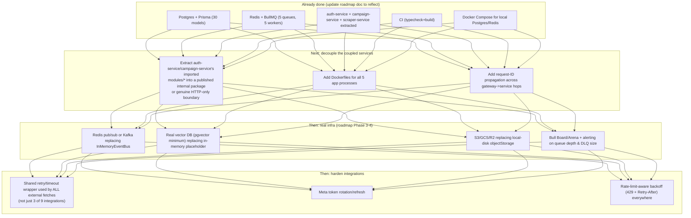

Concrete, prioritized suggestions:
1. **Split `router.ts`** into one router-module per resource area (mirroring the `modules/*` split already used for services) — mechanical, low-risk, high maintainability payoff.
2. **Add a service-layer workspace-scoping convention** (e.g., every `getX(id)` becomes `getX(workspaceId, id)` with a `WHERE workspaceId = ?` clause) across the modules flagged in §3.5/§13.2 — closes the remaining IDOR-shaped gaps beyond the workspace fix already made.
3. **Extract a shared `httpClient` helper** (timeout + retry + rate-limit awareness) and require every external fetch (9 integrations, only 3 currently retry) to go through it.
4. **Replace `InMemoryEventBus`** with Redis pub/sub as an incremental step before committing to Kafka (matches the existing roadmap's own sequencing advice: "don't introduce Kafka earlier than needed").
5. **Add Dockerfiles + a docker-compose override for the app processes themselves**, not just their data dependencies.
6. **Introduce a frontend data layer** (React Query or equivalent) to eliminate the current re-fetch-on-every-mount pattern before the ~90-method flat API client becomes unmanageable.

---

## 19. File Dependency Graph

Module-level (file-level would be too dense to be useful at ~25 modules × several files each) — arrows mean "imports from":

```mermaid
graph TD
    Router["gateway/router.ts"] --> business & strategy & analytics & orchestrator & drafts & assets & insights & notifications & audience & crm & adInsights & integrations & generation & onboarding & support & admin & billing & automation & optimization & copilot & strategist

    orchestrator["orchestrator/\ncampaignOrchestrator.ts"] --> adapters["adapters/\nmeta+google+tiktok+targeting mappers"]
    orchestrator --> integrations
    orchestrator --> strategy
    orchestrator --> business
    orchestrator --> eventBus["infra/eventBus.ts"]

    analytics["analytics/analyticsService.ts"] --> orchestrator
    analytics --> pipeline["pipeline/performancePipeline.ts"]
    analytics --> business
    analytics --> openaiClient["infra/openaiClient.ts"]

    pipeline --> orchestrator
    pipeline --> analyticsStore["infra/analyticsStore.ts"]

    insights["insights/insightService.ts"] --> orchestrator
    insights --> pipeline
    insights --> openaiClient

    adInsights["adInsights/adInsightsService.ts"] --> orchestrator
    adInsights --> pipeline

    strategy["strategy/strategyEngine.ts"] --> openaiClient

    onboarding["onboarding/\nscraper.ts + analysis.ts + marketResearch.ts + researchSessionService.ts"] --> openaiClient
    onboarding -.->|"screenshot only"| scraperServiceHTTP["scraper-service HTTP"]
    onboarding -.->|"no-key fallback"| pySidecar["Python ScrapeGraphAI sidecar"]

    integrations["integrations/\nintegrationService + metaOAuth + googleOAuth + productCatalogService"] --> crypto["infra/crypto.ts"]

    leadgen["leadgen/\nleadIngestionService + contactService + metaLeadSync + googleLeadSyncService"] --> integrations
    leadgen --> crm["crm/crmWebhookService.ts"]
    crm --> queue["infra/queue.ts"]

    copilot["copilot/copilotService.ts"] --> business
    copilot --> orchestrator
    copilot --> pipeline
    copilot --> openaiClient

    strategist["strategist/strategistService.ts"] --> business
    strategist --> orchestrator
    strategist --> analytics
    strategist --> openaiClient

    workers["workers/*.ts (5 files)"] --> queue
    workers --> onboarding
    workers --> generation["generation/\ngenerationJobService + creativeGenerationService + imageProvider + videoProvider"]
    workers --> leadgen
    workers --> pipeline
    workers --> optimization["optimization/optimizationEngine.ts"]
    workers --> insights
    workers --> crm

    authService["apps/auth-service/src/index.ts"] -.->|"cross-package import"| authModule["apps/api/src/modules/auth"]
    authService -.->|"cross-package import"| workspaceModule["apps/api/src/modules/workspace"]

    campaignService["apps/campaign-service/src/index.ts"] -.->|"cross-package import"| orchestrator
    campaignService -.->|"cross-package import"| pipeline
    campaignService -.->|"cross-package import"| optimization
    campaignService -.->|"cross-package import"| insights
    campaignService -.->|"cross-package import"| strategy
    campaignService -.->|"cross-package import"| billing["billing/billingEngine.ts"]
    campaignService -.->|"cross-package import"| onboarding

    webApp["apps/web (entire SPA)"] -->|"HTTP only, via api/client.ts"| Router
```

Dotted arrows mark cross-process boundaries (HTTP calls or cross-package source imports); solid arrows are same-process TypeScript imports.

---

## 20. Onboarding Summary — Where to Start Reading

For a senior engineer joining this project, in order:

1. **Read this document's §1 and §5 first** — the hybrid gateway/coupled-microservices topology and the Json-blob/soft-FK schema are the two facts that will otherwise cause the most confusion later.
2. **Read `apps/api/src/index.ts` and `gateway/router.ts` top-to-bottom** — despite its size, it's the fastest way to see the entire HTTP surface in one pass.
3. **Read one `modules/*` folder end-to-end** (e.g. `drafts/` — small, self-contained, touches both a queue-free CRUD pattern and the AI-recommendation pattern) before trying to read all 25.
4. **Read `infra/queue.ts` then one worker file** (`crmWebhookWorker.ts` is the shortest and most self-contained) to understand the async story before touching anything that enqueues a job.
5. **Read `docs/architecture-roadmap.md` for stated future intent**, cross-referencing against §16/§18 above for what's already been delivered versus what's still aspirational.
6. **Do not assume any two `Json`-blob models are related via a real foreign key** unless it's one of the 3 listed in §5.2 — this is the single most common wrong assumption a new engineer will make reading this schema for the first time.

This document is the current-state reference; treat `docs/architecture-roadmap.md` as historical/future-intent context only, and update both together as the system evolves.
