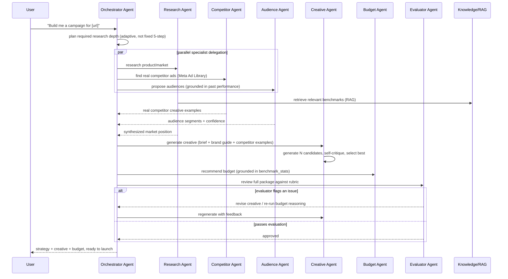

# Polluxa — Production Gap Analysis vs. AdsGo.ai-Class Platform

**Reviewer framing**: Principal Architect review. Current-state facts below are drawn from the verified reverse-engineering in `docs/CURRENT_ARCHITECTURE.md` and `docs/architecture-spec.json` — not re-derived here. "What AdsGo.ai likely has" is an **informed architectural inference** based on what mature, production AI-adtech platforms at that tier (Smartly.io, Madgicx, AdCreative.ai-class systems) typically require to operate at scale — not verified insider fact about one company. Stated once here rather than caveated 39 times below.

This document does not preserve any current design decision that is technically inferior at target scale. Where the current implementation is the right call even at scale (e.g., BullMQ over Kafka for single-consumer async work), that's said explicitly too — this is a review, not a rewrite-everything mandate.

---

## Gap Analysis — 39 Subsystems

### 1. API Gateway

| | |
|---|---|
| **Exists** | Single Express app (`apps/api`) acting as both gateway and business-logic host. `requireAuth`, a flat rate limiter, CORS, a generic `proxyTo()` reverse proxy with **no timeout, no retry**. |
| **AdsGo.ai likely has** | A real API gateway tier (Kong/Envoy/AWS API Gateway or a dedicated Node/Go gateway) doing routing, auth, rate limiting, request/response transformation, and **API versioning** as infrastructure — not application code. |
| **Missing** | API versioning (`/v1/`), per-route/per-tenant rate limiting (today it's one global 600 req/min/IP bucket), request timeout/circuit-breaking on internal proxy hops, canary/traffic-splitting capability. |
| **Why it matters** | At thousands of tenants, one misbehaving tenant or one hung downstream call (the no-timeout `proxyTo()`) can degrade the whole platform — there's no blast-radius containment today. |
| **How to implement** | Introduce a real gateway (Envoy or Kong) in front of the existing Express app; move rate limiting and circuit-breaking there; keep Express as an internal BFF (backend-for-frontend) behind it. |
| **Modules to change** | `gateway/proxy.ts` (add timeout/circuit-breaker as an interim step even before a full gateway swap), `gateway/middleware/rateLimit.ts` (per-tenant, not per-IP-global). |
| **New modules** | `gateway-config/` (versioned route manifest), circuit-breaker wrapper shared by every proxy call. |
| **Migration strategy** | Strangler: add per-tenant rate limiting and proxy timeouts first (zero-downtime, code-only). Introduce Envoy/Kong as a sidecar in front of the existing gateway later — DNS cutover, not a rewrite. |
| **Effort** | M (per-tenant limits + timeouts: 1-2 weeks) / L (full gateway swap: 4-6 weeks) |
| **Risk** | Low for the interim fixes; Medium for the full gateway swap (routing behavior must be byte-for-byte compatible). |

### 2. Authentication

| | |
|---|---|
| **Exists** | Custom JWT (register/login/Google), bcrypt-adjacent salted-hash passwords, workspace-membership + role checks (fixed this session — was a full unauthenticated IDOR before). Dev-mode bypass on the gateway's `requireAuth` when no header is present. |
| **AdsGo.ai likely has** | Managed identity (Auth0/WorkOS/Clerk) with SSO/SAML for enterprise buyers, MFA, session revocation lists, refresh-token rotation, device/session management UI. |
| **Missing** | SSO/SAML, MFA, refresh-token rotation (current tokens are long-lived JWTs with no revocation mechanism short of a secret rotation), session management UI, service-to-service auth beyond a static shared secret. |
| **Why it matters** | Enterprise ad-spend customers (the tier that matters for ARR) require SSO/SAML as a hard procurement requirement, and a stolen long-lived JWT today cannot be individually revoked. |
| **How to implement** | Introduce refresh + short-lived access tokens (15min access / 7d refresh, revocable). Add SSO via a managed provider rather than hand-rolling SAML. Replace the static `x-internal-service-key` with mTLS or per-service signed JWTs for internal calls. |
| **Modules to change** | `modules/auth/authService.ts` (token issuance), `auth-service` (add refresh endpoint), `gateway/middleware/auth.ts`, all 3 `internalAuth.ts` copies. |
| **New modules** | `modules/auth/sessionService.ts` (refresh-token store + revocation), `modules/auth/ssoService.ts`. |
| **Migration strategy** | Ship refresh tokens behind a feature flag, dual-accept old long-lived tokens for a deprecation window, then cut over. SSO is additive (new login path), no migration risk to existing users. |
| **Effort** | M (refresh tokens: 2 weeks) / L (SSO: 3-4 weeks with a managed provider) |
| **Risk** | Medium — token-format migration touches every authenticated request path. |

### 3. Campaign Service

| | |
|---|---|
| **Exists** | `campaignOrchestrator.ts`, imported directly (not over HTTP) by the `campaign-service` process — not independently deployable from `apps/api`'s source. Real Meta/Google hierarchy build, no rollback on partial failure, no idempotency key on launch. |
| **AdsGo.ai likely has** | A genuinely independent Campaign Service with its own repo/deploy pipeline, an explicit state machine for campaign lifecycle (draft→launching→active→paused→archived) with compensating transactions on partial failure, idempotent launch (dedup key), and a formal SLA on launch latency. |
| **Missing** | True service independence, saga/compensating-transaction pattern for partial ad-platform failures, idempotency keys, a campaign state machine (today status is derived ad hoc from variant statuses). |
| **Why it matters** | At scale, "AdSet succeeded but Ad upload failed, AdSet never cleaned up" (confirmed current behavior) becomes real orphaned spend liability across thousands of customers, not a rare edge case. |
| **How to implement** | Formalize a state machine (XState or a hand-rolled enum-transition table with a `campaign_events` audit trail), add a Redis-based idempotency lock keyed on `campaignId+launchAttempt`, implement saga-style rollback (if Ad creation fails, pause/delete the AdSet). |
| **Modules to change** | `campaignOrchestrator.launchCampaign/launchMetaHierarchy/launchGoogleHierarchy`. |
| **New modules** | `modules/orchestrator/campaignStateMachine.ts`, `modules/orchestrator/launchIdempotency.ts`. |
| **Migration strategy** | Add the idempotency lock and state machine as a wrapper around existing launch logic first (no behavior change for the happy path); add compensating rollback as a second pass once the state machine exists to hang it off. |
| **Effort** | L (4-6 weeks for state machine + saga rollback) |
| **Risk** | High — touches the money-spending code path; needs a shadow-mode rollout (log what *would* roll back before actually doing it). |

### 4. AI Service

| | |
|---|---|
| **Exists** | No dedicated AI service — 13 AI call sites scattered across `apps/api/src/modules/*`, all going through 3 thin helpers in `openaiClient.ts`. |
| **AdsGo.ai likely has** | A dedicated AI/ML service (often its own deployable, sometimes Python for ecosystem reasons) fronting all model calls: routing, caching, evaluation, cost tracking, multi-provider fallback. |
| **Missing** | Everything listed above — there is currently zero abstraction between "a module needs an AI answer" and "call OpenAI directly." |
| **Why it matters** | Every one of the 13 call sites independently owns its own prompt, error handling, and fallback — a provider outage or model deprecation requires 13 separate code changes today instead of one config change. |
| **How to implement** | Extract a single `ai-service` (or in-process `modules/ai/` facade as a first step) that all 13 call sites go through, with model routing, retry, and cost logging centralized. |
| **Modules to change** | All 13 AI call sites (`strategyEngine`, `analysis.ts`, `marketResearch.ts`, `strategistService`, `copilotService`, `draftsService`, `insightService`, `analyticsService`, `creativeGenerationService`, `creativesService`, plus the 3 scraper-service LLM stages) — each swaps its direct `openaiClient` import for the new facade. |
| **New modules** | `modules/ai/aiGatewayService.ts` (routing+retry+cost logging), `modules/ai/modelRegistry.ts`. |
| **Migration strategy** | Introduce the facade with byte-identical behavior to today (thin passthrough), migrate call sites one at a time, add routing/fallback logic only after all 13 are migrated onto the facade. |
| **Effort** | L (facade + migration: 4-5 weeks) |
| **Risk** | Low if done as a passthrough-first migration; each call site swap is independently testable. |

### 5. Scraper Service

| | |
|---|---|
| **Exists** | Genuinely independent process, well-structured 7-stage Playwright pipeline — the best-organized service in the current system. Single shared browser instance, no horizontal scale-out (one process = one Chromium pool). |
| **AdsGo.ai likely has** | A horizontally-scaled scraping fleet (multiple Chromium workers behind a queue, not a single in-process browser pool), proxy rotation / anti-bot evasion for hostile sites, a scraping-job queue rather than synchronous request/response. |
| **Missing** | Horizontal scale-out, proxy rotation, scrape-job queueing (today `/products/import` is a single synchronous HTTP request that can take 20s+ of Playwright time per call, tying up one gateway request thread the whole time via the un-timed-out proxy). |
| **Why it matters** | A single Chromium pool serializes throughput — at real product-catalog-import volume (thousands of customers importing dozens of SKUs each), this becomes the platform's throughput ceiling. |
| **How to implement** | Move `/products/import` behind a BullMQ queue (mirrors the pattern already used for creative-generation), run N worker replicas each with their own bounded Chromium pool, add a rotating-proxy provider (Bright Data/Oxylabs) for sites that block scraping. |
| **Modules to change** | `scraper-service/src/index.ts` (route becomes enqueue-and-202, not synchronous), `scraper-service/src/scraping/browser.ts` (pool sizing). |
| **New modules** | `product-import` queue + `productImportWorker`. |
| **Migration strategy** | Additive — keep the synchronous route for backward compat during transition, add the async route, migrate the frontend's product-import UI to poll like generation-jobs already does. |
| **Effort** | M (2-3 weeks) |
| **Risk** | Low — same pattern already proven elsewhere in this codebase (generation-jobs). |

### 6. Queue Architecture

| | |
|---|---|
| **Exists** | 5 well-configured BullMQ queues on Redis, sensible per-queue attempts/backoff, deliberate no-retry on research-session for cost control. |
| **AdsGo.ai likely has** | The same BullMQ-class pattern for single-consumer async work (this part is *not* technically inferior — don't replace it), **plus** a Kafka/Kinesis-class event stream for multi-consumer fan-out events (campaign launched, lead created, budget changed) that today only has one consumer each. |
| **Missing** | A genuine event bus for 1-to-many fan-out (see Event Bus below) — BullMQ queues are correctly used for 1-to-1 job dispatch, but the app has events (`campaign.launched`) that *should* have multiple independent consumers (analytics, billing, notifications) and currently can't, because BullMQ queues aren't pub/sub. |
| **Why it matters** | Adding a new consumer to "campaign launched" today means editing the one existing publisher's call site — not subscribing independently. This doesn't scale past ~3-4 consumers of the same event. |
| **How to implement** | Keep BullMQ for job queues. Add Redis Streams (cheap, already-running infra) or Kafka (if consumer count/durability needs grow past what Streams comfortably handles) purely for fan-out events. |
| **Modules to change** | None of the 5 existing queues — they're fine as-is. |
| **New modules** | `infra/eventStream.ts` (Redis Streams or Kafka producer/consumer wrapper). |
| **Migration strategy** | Additive only — new event types go on the new stream; don't migrate the 5 existing job queues, they're doing the right job for their use case. |
| **Effort** | M (2-3 weeks for Redis Streams; L, 6+ weeks, for Kafka) |
| **Risk** | Low (Redis Streams, reuses existing infra) to Medium (Kafka, new infra + ops burden). |

### 7. Worker Architecture

| | |
|---|---|
| **Exists** | 5 standalone Node processes, each `new Worker()` hand-rolled with no shared runtime abstraction — duplicated boilerplate across all 5 files. |
| **AdsGo.ai likely has** | A shared worker-runtime package (common health-check endpoint, common graceful-shutdown, common structured logging/tracing hookup) that every worker imports, so adding worker #6 doesn't mean copy-pasting worker #5's boilerplate. |
| **Missing** | Shared runtime abstraction, per-worker health-check HTTP endpoint (for k8s liveness/readiness probes — none of the 5 workers expose one today), graceful shutdown handling beyond `crmWebhookWorker`'s browser-close-on-SIGTERM equivalent. |
| **Why it matters** | Without a health-check endpoint, an orchestrator (k8s/ECS) can't tell a hung worker from a healthy one — it'll just leave a dead worker "running" indefinitely. |
| **How to implement** | Extract `infra/workerRuntime.ts` (health endpoint, SIGTERM handling, structured logger injection, standard concurrency/metrics reporting), have all 5 workers construct via it. |
| **Modules to change** | All 5 files under `apps/api/src/workers/*`. |
| **New modules** | `infra/workerRuntime.ts`. |
| **Migration strategy** | Mechanical, one worker at a time, fully backward compatible (same queue/job behavior, only the process-lifecycle wrapper changes). |
| **Effort** | S (1 week) |
| **Risk** | Low. |

### 8. Event Bus

| | |
|---|---|
| **Exists** | `InMemoryEventBus` (`EventEmitter` wrapper), one publisher (`campaign.launched`), one subscriber (logs only). Explicitly a documented placeholder. Does not survive a process restart, does not work across gateway replicas. |
| **AdsGo.ai likely has** | A durable, replica-safe event bus (Kafka/Kinesis/Redis Streams) with multiple real consumers: billing (usage metering), analytics (funnel tracking), notifications (in-app + email), audit log. |
| **Missing** | Everything past "logs a line" — this is the single most consequential correctness gap for horizontal scale (see `docs/CURRENT_ARCHITECTURE.md` §15: this is a correctness bug, not a performance one, the moment the gateway runs >1 replica). |
| **Why it matters** | Any future consumer of `campaign.launched` (billing, analytics) added while running multiple gateway replicas will silently miss events published on other replicas, with no error — a very hard bug to detect in production. |
| **How to implement** | Replace `InMemoryEventBus`'s transport with Redis Streams (consumer groups give replica-safe delivery, at-least-once semantics) behind the *same* `publish`/`subscribe` interface, so call sites don't change. |
| **Modules to change** | `infra/eventBus.ts` only (interface-compatible swap). |
| **New modules** | None — this is a transport swap under an existing interface. |
| **Migration strategy** | Because the interface doesn't change, this is a pure infra swap: deploy the new transport, verify the existing single subscriber still receives events, then add new subscribers. |
| **Effort** | M (2 weeks) |
| **Risk** | Medium — must verify at-least-once delivery semantics don't break the (currently log-only, so low-stakes) existing subscriber, before higher-stakes subscribers (billing) are added. |

### 9. Database Design

| | |
|---|---|
| **Exists** | 30 Prisma models, only 3 real foreign keys, ~25 models store payload as opaque `data Json`. Functional, but application-enforced referential integrity only. |
| **AdsGo.ai likely has** | A properly normalized relational core (users, workspaces, campaigns, ad sets, ads as first-class typed tables with real FKs) for anything transactional, with `Json`/JSONB reserved for genuinely schemaless data (raw platform API responses, audit payloads) — not the default for everything. |
| **Missing** | Real foreign keys and typed columns on the ~25 blob-backed models; a read-optimized analytics store (the current single Postgres does both OLTP and OLAP-ish aggregation, e.g. `metricsIngestionWorker`'s cross-workspace scans). |
| **Why it matters** | JSON-blob-everywhere means every "list campaigns where X" query either needs a Postgres JSON-path index (fragile, easy to miss) or a full scan + JS-side filter (confirmed present in `listActiveCampaigns`) — this is a genuine query-performance ceiling, not a style preference. |
| **How to implement** | Incrementally "promote" the highest-traffic fields out of `data Json` into real typed columns (start with `Campaign.status`, `Campaign.dailyBudgetCents` — the two fields every hot-path query filters/sorts on), keeping `data` for the long tail of less-queried fields. Add a columnar/OLAP store (ClickHouse or Postgres+TimescaleDB, per the existing `docs/architecture-roadmap.md`'s own Phase 4 note) for `Metric`/performance data specifically. |
| **Modules to change** | Every module reading/writing `Campaign`/`AdSet`/`Ad` (`campaignOrchestrator`, `draftsService`, `performancePipeline`) needs to read from the new typed columns instead of `data.status` etc. |
| **New modules** | A migration script per promoted field (Prisma migration + one-time backfill query). |
| **Migration strategy** | Expand-contract per field: add the new typed column (nullable), dual-write both `data.field` and the new column for one release, backfill existing rows, switch reads to the new column, then drop the field from `data` in a later release. One field at a time, never a big-bang schema rewrite. |
| **Effort** | XL (this is genuinely a multi-quarter effort done field-by-field; each individual field promotion is S-M) |
| **Risk** | Medium per individual field promotion (well-understood expand-contract pattern); High if attempted as one big migration instead. |

### 10. Caching

| | |
|---|---|
| **Exists** | None. Redis exists but is used exclusively for BullMQ — zero cache usage. Frontend has zero request caching either. |
| **AdsGo.ai likely has** | Multi-layer caching: Redis for hot-path reads (workspace/integration lookups, analytics summaries), CDN for static assets and generated creative images, frontend query caching (React Query-class) for the API layer. |
| **Missing** | All of it. |
| **Why it matters** | `getAnalyticsSummary`, `getOrCreateIntegrations`, and workspace-membership checks are called on nearly every request and hit Postgres every single time — this is pure, easily-avoidable latency and DB load at any real traffic volume. |
| **How to implement** | Add a read-through Redis cache for the highest-frequency, low-write-rate reads first (workspace/integration/membership lookups — TTL 30-60s is plenty given how rarely those change), a CDN (CloudFront/Cloudflare) in front of `/objects` and generated creative assets once object storage moves off local disk, and React Query on the frontend. |
| **Modules to change** | `integrationService.getOrCreateIntegrations`, `workspaceService.getMembership`, `analyticsService.getAnalyticsSummary`. |
| **New modules** | `infra/cache.ts` (read-through Redis cache helper with TTL + invalidation-on-write). |
| **Migration strategy** | Additive, per-function, cache-aside pattern — wrap one function at a time, verify cache invalidation on the corresponding write path before moving to the next. |
| **Effort** | M (backend caching: 2-3 weeks) / M (frontend React Query adoption: 2-3 weeks, can run in parallel) |
| **Risk** | Medium — cache invalidation bugs (stale membership data after a role change) are the classic failure mode here; needs careful invalidation-on-write for anything security-relevant (membership/role checks especially). |

### 11. Vector Database

| | |
|---|---|
| **Exists** | `infra/vectorStore.ts` — explicit in-memory placeholder, hash-based (non-semantic) fake "embedding," used only for scraper-service's image-similarity dedup. Doesn't survive a restart, doesn't work across replicas. |
| **AdsGo.ai likely has** | A real vector DB (pgvector, Pinecone, Weaviate, or Qdrant) with real embeddings (OpenAI `text-embedding-3-*` or similar), used for: semantic product/creative similarity, RAG retrieval for chat/research grounding, competitor-creative clustering. |
| **Missing** | Real embeddings, a persistent/replica-safe vector store, any retrieval use beyond image dedup. |
| **Why it matters** | Every AI pipeline in this app (research, strategy, chat) currently re-derives context from scratch via Prisma reads + prompt-stuffing — there's no semantic memory of past campaigns, past research, or industry patterns to draw on, which is exactly the differentiator a mature platform would lean on. |
| **How to implement** | Start with pgvector (same Postgres instance, lowest new-infra cost, `CREATE EXTENSION vector`), real OpenAI embeddings on ingest, cosine-similarity queries for retrieval. Graduate to a dedicated vector DB only if query volume/latency requirements outgrow pgvector. |
| **Modules to change** | `scraper-service/src/pipeline/vectorIndex.ts` (swap fake hash embedding for real OpenAI embedding call + pgvector query). |
| **New modules** | `infra/embeddings.ts`, `modules/knowledge/knowledgeService.ts` (see Knowledge Base below). |
| **Migration strategy** | Add pgvector as a new capability first (product-similarity use case, lowest risk, already has a consumer). Expand to RAG-grounded chat only once the embedding pipeline is proven. |
| **Effort** | M (pgvector + embeddings: 2-3 weeks) |
| **Risk** | Low — additive, no existing behavior depends on the current fake embeddings being semantically meaningful (they aren't, today). |

### 12. Prompt Management

| | |
|---|---|
| **Exists** | 13+ inline prompt strings hardcoded across as many files, no versioning, no A/B capability, prompt changes require a full code deploy. |
| **AdsGo.ai likely has** | A prompt registry (even a simple versioned DB table is enough at this stage — dedicated tools like Langfuse/PromptLayer are a later-stage nice-to-have) decoupling prompt iteration from code deploys, with version history and the ability to A/B two prompt variants. |
| **Missing** | Everything past "it's a string literal in the code." |
| **Why it matters** | Every prompt tweak today requires a full backend deploy and can't be tested against a held-out set before shipping to 100% of traffic — this directly blocks AI Evaluation (item 36) from being meaningful, since there's no way to compare prompt version A vs. B without a deploy each. |
| **How to implement** | A `prompt_versions` table (`name`, `version`, `template`, `created_at`, `is_active`), a thin `getPrompt(name)` accessor every call site uses instead of an inline string, an admin-only endpoint to publish a new version. |
| **Modules to change** | All 13 AI call sites — replace the inline prompt string with `getPrompt("strategist.system")` etc. |
| **New modules** | `modules/prompts/promptRegistryService.ts`. |
| **Migration strategy** | Seed the registry with today's exact prompt strings (zero behavior change on day one), then migrate call sites one at a time to read from the registry instead of the literal. |
| **Effort** | M (2-3 weeks including all 13 call-site migrations) |
| **Risk** | Low — the seeded values are byte-identical to current behavior. |

### 13. Multi-Agent Architecture

| | |
|---|---|
| **Exists** | None. Every AI call is one-shot: gather context → single prompt → parse response. No planner, no tool-calling loop, no inter-agent handoff, no reflection/critique pass. The 5-block "deep research pipeline" is a **fixed sequential script**, not agents. |
| **AdsGo.ai likely has** | A real multi-agent system: an orchestrator/planner agent that decomposes a request, delegates to specialist agents (research, competitor, audience, creative, budget) each with their own tool access, and a critique/evaluator pass before returning a final answer to the user. |
| **Missing** | Everything — this is the single largest capability gap between the current system and a genuinely "AI-native" competitor. |
| **Why it matters** | A fixed 5-step script can't adapt (e.g., skip competitor research if the business has no discoverable competitors, or go deeper on audience research if the first pass came back thin) — a real agent architecture can reason about what it still needs and go get it, which is the actual product differentiation "AI-driven campaign platform" implies. |
| **How to implement** | Introduce a planner/orchestrator agent using explicit tool-calling (OpenAI function calling already used for `runStructured` — extend the pattern to a loop: call model with tools, execute whichever tool it picks, feed the result back, repeat until it emits a final answer). Start with 2-3 specialist agents (Research, Creative, Budget) sharing a common `AgentContext` object, coordinated by one orchestrator. Add a lightweight evaluator/critique agent that reviews the orchestrator's final output against a rubric before it's shown to the user. |
| **Modules to change** | `onboarding/marketResearch.ts` (becomes tool-implementations the Research agent calls, not the driver itself), `generation/creativeGenerationService.ts` (becomes the Creative agent's tool). |
| **New modules** | `modules/agents/orchestratorAgent.ts`, `modules/agents/researchAgent.ts`, `modules/agents/creativeAgent.ts`, `modules/agents/budgetAgent.ts`, `modules/agents/evaluatorAgent.ts`, `modules/agents/agentRuntime.ts` (shared tool-calling loop + trace logging). |
| **Migration strategy** | Run the new agent architecture *alongside* the existing fixed pipeline behind a feature flag, compare output quality (this is exactly what AI Evaluation, item 36, is for), cut over research-session traffic gradually once the agent path's quality bar is met. |
| **Effort** | XL (this is a 2-3 month initiative, the largest single item in this review) |
| **Risk** | High — new failure modes (agent loops that don't terminate, runaway tool-calling cost) need explicit guardrails (max-iteration caps, per-run cost ceilings) from day one. |

### 14. Website Crawling

| | |
|---|---|
| **Exists** | Two independent pipelines (cheerio-based onboarding crawler, Playwright-based product importer) — reasonably solid, though `robots.txt` `Disallow` isn't honored and there's no cross-request rate limiting. |
| **AdsGo.ai likely has** | The same two-tier pattern (lightweight for text/metadata, full-browser for JS-rendered single pages) — this part is *not* technically inferior, keep it — plus `robots.txt` compliance and per-domain crawl-rate limiting. |
| **Missing** | `robots.txt` `Disallow` honoring, per-domain rate limiting across concurrent onboarding submissions (two customers onboarding the same competitor's site simultaneously currently hit it with no coordination). |
| **Why it matters** | Ignoring `Disallow` is a real legal/ToS exposure at scale (thousands of customers scraping thousands of sites) that's currently invisible because volume is low. |
| **How to implement** | Add a `robots-parser`-class library check before crawling any page beyond the entry URL; add a per-domain token-bucket rate limit (Redis-backed) shared across all crawl requests, not just within one request's 45s budget. |
| **Modules to change** | `onboarding/scraper.ts`. |
| **New modules** | `infra/domainRateLimiter.ts`. |
| **Migration strategy** | Additive, low-risk — add the robots check as a filter on the existing page-discovery list; add rate limiting as a wrapper around the existing fetch calls. |
| **Effort** | S (1 week) |
| **Risk** | Low. |

### 15. Search Intelligence

| | |
|---|---|
| **Exists** | None as a distinct capability — Meta/Google *interest*/*keyword* targeting resolution exists (`metaTargetingMapper`/`googleTargetingMapper`), but there's no SEO/SEM keyword-volume/difficulty research anywhere. |
| **AdsGo.ai likely has** | Integration with a keyword-data provider (SEMrush/Ahrefs/Google Keyword Planner API) to inform both SEM campaign keyword selection and content/creative angle ideation. |
| **Missing** | The entire capability. |
| **Why it matters** | Budget/creative recommendations today are grounded in AI-model-training-data guesses about competitive landscape, not real search-volume/CPC data — a real search-intelligence integration would materially improve the accuracy of the budget-prediction and competitor-discovery pipelines. |
| **How to implement** | Integrate one keyword-data API (Google Keyword Planner API is free with a Google Ads account and is the most directly relevant), feed its output into `analyzeCompetitorsAndBudget`'s context as real data rather than model-guessed data. |
| **Modules to change** | `onboarding/marketResearch.ts` (`analyzeCompetitorsAndBudget` gets a new real-data input). |
| **New modules** | `modules/search/keywordIntelligenceService.ts`. |
| **Migration strategy** | Additive — new data source feeds into existing prompt context, no existing behavior changes until the new data is wired in. |
| **Effort** | M (3-4 weeks incl. Google Keyword Planner API onboarding/approval lead time) |
| **Risk** | Low. |

### 16. Competitor Discovery

| | |
|---|---|
| **Exists** | `analyzeCompetitorsAndBudget` names competitors via live web search (OpenAI `gpt-4o-search-preview`) — reasoning-based discovery, not a real ad-library data source. |
| **AdsGo.ai likely has** | Direct integration with Meta Ad Library API and Google Ads Transparency Center to see competitors' **actual running ads** (creative, copy, estimated spend/reach) — not just AI-inferred competitor names. |
| **Missing** | Real ad-library data. Today's "competitor analysis" is an LLM's best guess from web search, not verified real ad data. |
| **Why it matters** | This is the single highest-leverage, most defensible data advantage a competitor platform would build — "here's literally what your competitor is running right now" is a materially stronger product claim than "the AI thinks these are your competitors." |
| **How to implement** | Integrate Meta Ad Library API (public, no special access needed for basic search) and Google Ads Transparency Center; a scheduled worker periodically refreshes tracked-competitor ad sets per business; store results in a new `competitor_ads` table; feed real creative/copy examples into the Creative agent's context. |
| **Modules to change** | `onboarding/marketResearch.ts` (`analyzeCompetitorsAndBudget` gains a real-data input alongside its web-search reasoning). |
| **New modules** | `modules/competitors/competitorAdLibraryService.ts`, `competitorMonitoringWorker` (new queue+worker). |
| **Migration strategy** | Additive — ship as a new panel/data source in the research output first, blend into the AI prompt context only after the raw data pipeline is proven reliable. |
| **Effort** | L (4-6 weeks) |
| **Risk** | Low-Medium (public APIs, but Meta's Ad Library API has its own rate limits/terms to respect — add retry/backoff and caching from day one, unlike the current adapters' inconsistent retry story). |

### 17. Market Research

| | |
|---|---|
| **Exists** | The 5-block deep-research pipeline — genuinely the standout piece of engineering in the current system (real cost controls, real 2-tier graceful degradation, real caching). Don't rewrite this wholesale; evolve it into the Multi-Agent Architecture (item 13) rather than replacing it. |
| **AdsGo.ai likely has** | The same category of capability, likely agent-driven (adaptive depth) rather than a fixed 5-step script, and grounded in real data sources (item 16) rather than web-search-only. |
| **Missing** | Adaptivity (fixed steps regardless of what's actually needed) and real-data grounding beyond web search. |
| **Why it matters** | Covered under items 13 and 16 — this is the pipeline those two improvements attach to, not a separate gap in itself. |
| **How to implement** | See items 13 and 16 — this pipeline becomes the Research Agent's implementation once multi-agent architecture lands. |
| **Modules to change** | `onboarding/marketResearch.ts`, `workers/researchSessionWorker.ts`. |
| **New modules** | (Covered by items 13/16.) |
| **Migration strategy** | (Covered by items 13/16.) |
| **Effort** | (Covered by items 13/16 — no separate effort line here.) |
| **Risk** | (Covered by items 13/16.) |

### 18. Audience Intelligence

| | |
|---|---|
| **Exists** | `analyzeAudienceDeep` (research-time personas) + `getAudienceSuggestions` (standalone, on-demand suggestions) — both single-shot `runStructured` calls, no real audience-performance feedback loop. |
| **AdsGo.ai likely has** | Audience suggestions informed by **actual performance data across the customer's own past campaigns** (which segments actually converted), not just model-guessed personas from business description alone. |
| **Missing** | Closing the loop from `normalizePerformance`'s real per-campaign data back into audience suggestions — today these two systems don't talk to each other at all. |
| **Why it matters** | A returning customer's 3rd campaign should get audience suggestions informed by what actually worked on their 1st and 2nd — today it re-guesses from scratch every time, discarding real signal the platform already has. |
| **How to implement** | Feed `normalizePerformance`/`getAnalyticsSummary` history into `getAudienceSuggestions`'s prompt context when a business has prior campaign data, alongside the existing business-profile-only context. |
| **Modules to change** | `analytics/analyticsService.getAudienceSuggestions`. |
| **New modules** | None — this is a context-enrichment change to an existing function. |
| **Migration strategy** | Additive, single-function change, easy to A/B (compare suggestion quality with/without performance context via AI Evaluation). |
| **Effort** | S (1-2 weeks) |
| **Risk** | Low. |

### 19. Creative Generation

| | |
|---|---|
| **Exists** | Brief → image (OpenAI `gpt-image-1`) → optional video (Runway) → asset, async via `creativeGenerationWorker`. Reasonable pipeline shape, but each stage is a single-shot generation with no critique/iteration and no brand-consistency enforcement across multiple creatives. |
| **AdsGo.ai likely has** | A Creative Director agent that generates multiple candidate variants, self-critiques against brand guidelines (`BrandProfile` data already exists in this app but isn't fed into generation), and iterates before presenting a final option — plus a persistent brand style/voice guide enforced across every generated asset. |
| **Missing** | Multi-candidate generation + selection, brand-consistency enforcement, iteration/refinement loop. |
| **Why it matters** | Single-shot generation with no critique means creative quality is whatever the model produces on the first try — a real differentiator is generating 3-5 candidates and having a critique step pick (or synthesize from) the best, which is exactly what the existing `generateCreativeVariations` function does for *copy* but not for image/video. |
| **How to implement** | Extend the existing 3-variant copy pattern (`creativesService.generateCreativeVariations`) to images: generate N image candidates in parallel, run a cheap-model vision critique pass scoring each against the brief + brand guide, surface the top-scored candidate (or let the user pick from all N). |
| **Modules to change** | `generation/creativeGenerationService.ts`, `generation/imageProvider.ts` (parallel N-candidate generation). |
| **New modules** | `modules/agents/creativeCritiqueAgent.ts` (or fold into item 13's Creative agent once that exists). |
| **Migration strategy** | Ship as an opt-in "Generate variations" button first (additive UI), make it the default once quality/cost tradeoff is validated. |
| **Effort** | M (3-4 weeks) |
| **Risk** | Low-Medium (cost scales linearly with N candidates — needs a per-tenant cost ceiling, see item 38). |

### 20. Budget Prediction

| | |
|---|---|
| **Exists** | `analyzeCompetitorsAndBudget`'s explicit LLM reasoning chain (value → CPA → CVR → clicks → CPC → daily budget) — a genuinely good *explainable* pattern, better than a black-box number. Don't discard the explainability; ground it in better data. |
| **AdsGo.ai likely has** | The same category of recommendation, but blending real historical performance data (this business's past campaigns, aggregated/anonymized cross-customer benchmarks by vertical) with the LLM reasoning, rather than the LLM's training-data guess about typical CPCs being the only input. |
| **Missing** | Real benchmark data as an input; any actual predictive model (today it's 100% LLM reasoning, zero statistical/ML component). |
| **Why it matters** | An LLM's "typical CPC for this vertical" is a plausible-sounding guess, not a number grounded in this platform's own aggregate data — once there are thousands of customers, the platform *has* real benchmark data it isn't using. |
| **How to implement** | Build an aggregated (anonymized, opt-in) benchmark dataset from real customer campaign performance, grouped by industry/vertical/network; feed the relevant benchmark slice into the existing reasoning-chain prompt as grounding data (this is a RAG-style use case, see item 24) rather than replacing the explainable-reasoning approach. |
| **Modules to change** | `onboarding/marketResearch.ts` (`analyzeCompetitorsAndBudget`). |
| **New modules** | `modules/benchmarks/benchmarkAggregationService.ts` (scheduled job computing anonymized vertical-level stats from `Metric`/performance data across all tenants). |
| **Migration strategy** | The benchmark aggregation job can run and populate data well before it's wired into any prompt — build the data pipeline first, validate it looks sane, then wire it into the existing prompt as an added context block. |
| **Effort** | L (4-5 weeks, mostly the aggregation pipeline + privacy/anonymization review) |
| **Risk** | Medium — cross-tenant data aggregation needs a clear privacy/ToS story (customers must be told their anonymized performance informs platform-wide benchmarks) before shipping. |

### 21. Campaign Optimization

| | |
|---|---|
| **Exists** | `optimizationEngine.runOptimizationPass` — pure heuristic/bandit logic, **zero LLM involvement**, despite feeding an "AI Insights" feed downstream that implies AI-driven decisions. Runs every 15 minutes via `metricsIngestionWorker`, single-concurrency, sequential per-campaign. |
| **AdsGo.ai likely has** | A genuine hybrid: fast heuristic rules for time-sensitive actions (pause a clearly-failing ad within minutes) plus an LLM/agent-reasoning layer for the more nuanced calls (budget reallocation rationale, creative-fatigue detection) — and the naming should match reality (don't call heuristic-only logic "AI Insights" if there's no AI in the loop). |
| **Missing** | Any actual AI/ML component in the optimization decision itself; horizontal scale-out of the optimization pass (single concurrency, sequential loop, per §11 of the current-state doc, is a real ceiling as active-campaign count grows). |
| **Why it matters** | The naming mismatch ("AI Insights" fed by a non-AI heuristic) is a product-integrity issue as much as a technical one; separately, the single-concurrency sequential design is a confirmed scale ceiling. |
| **How to implement** | Parallelize the per-campaign loop (process N campaigns concurrently, bounded by a worker pool, not a single sequential `for`). Add an LLM reasoning pass *on top of* the heuristic's raw pause/scale signal to generate the human-readable rationale shown in Insights (reusing the same `runText` pattern already used for `draftsService.generateAiRecommendation`) — this makes the "AI Insights" naming honest without discarding the heuristic engine, which is fine and fast for the mechanical decision itself. |
| **Modules to change** | `optimization/optimizationEngine.ts`, `workers/metricsIngestionWorker.ts` (parallelize the fan-out). |
| **New modules** | None required for the parallelization; the LLM-rationale layer can live in `insightService.ts` alongside its existing `generateInsights`. |
| **Migration strategy** | Parallelize the worker loop first (pure performance change, no behavior change, easy to verify). Add the LLM-rationale layer as a second, independent change. |
| **Effort** | S (parallelization: 1 week) + S (LLM rationale: 1-2 weeks) |
| **Risk** | Low for parallelization (bound the concurrency, test under load); Low for the rationale layer (additive text, doesn't change any actual optimization decision). |

### 22. Asset Generation

| | |
|---|---|
| **Exists** | Image via OpenAI `gpt-image-1` (raw fetch, bypasses the SDK), video via Runway (image-to-video only) — both single-provider, no fallback, no retry on any of Runway's 3 calls. |
| **AdsGo.ai likely has** | Multi-provider fallback for both image (OpenAI + Midjourney-API-class alternative) and video (Runway + Pika/Luma-class alternative), with automatic failover if a provider is down or rate-limited. |
| **Missing** | Provider fallback, retry on the image/video generation calls specifically (they're the least resilient external calls in the whole integration inventory today). |
| **Why it matters** | A generation job failing because of a transient Runway hiccup (no retry today) wastes the entire async job (image was generated, money spent, but the job fails at the video step with no retry) — this is pure avoidable cost/waste. |
| **How to implement** | Add `fetchWithRetry`-class wrapping (the pattern already exists in `metaAdapter.ts`/`googleAdapter.ts` — reuse it, don't reinvent) around the image/video provider calls; add a second provider behind the existing `getImageProvider()`/`getVideoProvider()` abstraction (which already supports swapping implementations — it's designed for exactly this, just never given a second real implementation). |
| **Modules to change** | `generation/imageProvider.ts`, `generation/videoProvider.ts`. |
| **New modules** | A second concrete provider class per interface (e.g. `MidjourneyImageProvider`, `PikaVideoProvider`) — exact choice is a build decision, not an architecture one. |
| **Migration strategy** | Add retry first (zero new dependencies, immediate resilience win). Add the second provider + failover logic as a separate, later change once a vendor is chosen. |
| **Effort** | S (retry: 3-4 days) / M (second provider + failover: 2-3 weeks) |
| **Risk** | Low. |

### 23. Knowledge Base

| | |
|---|---|
| **Exists** | None as a distinct system — grounding data is assembled ad hoc, per-request, from live Prisma reads only. No curated, versioned, or persistent knowledge corpus of any kind. |
| **AdsGo.ai likely has** | A curated corpus: industry CPM/CPC benchmarks by vertical, per-platform ad-policy/compliance rules, a creative-performance pattern library, historical case studies — ingested, chunked, embedded, and kept current on a schedule. |
| **Missing** | The entire capability. |
| **Why it matters** | This is the substrate that makes items 20 (budget prediction), 24 (RAG), and the Creative agent's brand-consistency checks (item 19) actually work with real grounding instead of pure LLM-guessed context. |
| **How to implement** | Stand up a `knowledge_documents`/`knowledge_chunks` schema (pgvector-backed, per item 11), seed it with a curated initial corpus (platform policy docs, industry benchmark reports), add an ingestion pipeline for the benchmark-aggregation output from item 20, keep it current via a scheduled refresh worker. |
| **Modules to change** | None existing — purely additive. |
| **New modules** | `modules/knowledge/knowledgeService.ts` (ingest, chunk, embed, retrieve), `knowledgeRefreshWorker`. |
| **Migration strategy** | Build the ingestion/retrieval pipeline and seed it with a small curated set first; expand corpus breadth over time. No migration of existing data required — this is new capability, not a replacement for anything. |
| **Effort** | L (4-6 weeks for the pipeline + initial corpus curation) |
| **Risk** | Low (additive), though corpus *quality* is an ongoing content-curation effort, not just an engineering one. |

### 24. RAG

| | |
|---|---|
| **Exists** | None. No embeddings, no chunking, no retrieval step in any of the 13 AI pipelines — every pipeline stuffs whatever Prisma data it fetched directly into the prompt with no relevance ranking. |
| **AdsGo.ai likely has** | Retrieval-augmented prompts for the Strategist/Copilot chats and the budget/creative recommendation pipelines, pulling the most relevant chunks from the Knowledge Base (item 23) + Vector DB (item 11) rather than just the current business's own raw Prisma rows. |
| **Missing** | The entire retrieval layer. |
| **Why it matters** | Chat answers today are grounded *only* in the current business's own live data — there's no way for the Strategist/Copilot to reference "here's what worked for similar businesses" or "here's the platform's policy on X," both of which are exactly the kind of answer a user would expect from an "AI that's seen thousands of campaigns." |
| **How to implement** | Build a `retrieve(query, filters)` function over the pgvector store from item 11/23, call it from `strategistService`/`copilotService` before constructing the system prompt, append top-K retrieved chunks to the existing context blob. |
| **Modules to change** | `strategist/strategistService.ts`, `copilot/copilotService.ts` (both gain a retrieval step before prompt construction). |
| **New modules** | `modules/knowledge/retrievalService.ts`. |
| **Migration strategy** | Ship behind a flag on Copilot first (lower stakes than Strategist, per the existing "never claims to execute actions" guardrail already built this session), compare answer quality via AI Evaluation, then extend to Strategist. |
| **Effort** | M (3-4 weeks, assuming items 11/23 already exist) |
| **Risk** | Low-Medium — retrieved-but-irrelevant chunks can degrade answer quality if the retrieval ranking is poor; needs the AI Evaluation harness (item 36) to catch regressions. |

### 25. LLM Orchestration

| | |
|---|---|
| **Exists** | Direct SDK calls scattered across 13 files through 3 thin helpers. No streaming (full-response-only everywhere), no context-window management, no unified error handling. |
| **AdsGo.ai likely has** | A real orchestration layer: streaming responses (SSE) for chat, context-window truncation/summarization strategy for long conversations, unified error handling/fallback across every call site, request/response logging for the AI Evaluation and Cost Optimization pipelines. |
| **Missing** | Streaming (Strategist and Copilot chat both currently wait for the full response before showing anything — no token-by-token UX), context management (a long chat conversation will eventually exceed the model's context window with no truncation strategy today), unified logging. |
| **Why it matters** | Streaming is a baseline UX expectation for any chat product in 2026 — the current full-response-wait pattern reads as noticeably slower than it needs to, even though the underlying model latency is the same. |
| **How to implement** | Add a `runTextStream` helper alongside the existing `runText` (Server-Sent Events from the gateway route through to the frontend's `EventSource`/fetch-stream consumption), add a sliding-window or summarization-based truncation strategy once conversation length exceeds a threshold, route all AI calls through the item-4 AI Service facade for unified logging. |
| **Modules to change** | `infra/openaiClient.ts` (add streaming variant), `strategist/strategistService.ts`, `copilot/copilotService.ts`, `MediaPlan.tsx`/`CopilotProvider.tsx` on the frontend (SSE consumption instead of await-full-response). |
| **New modules** | None beyond the streaming helper — this extends the existing facade rather than replacing it. |
| **Migration strategy** | Add streaming as an alternate code path behind a flag, migrate Copilot first (built this session, easiest to iterate on), then Strategist. |
| **Effort** | M (3-4 weeks, frontend + backend both need changes) |
| **Risk** | Low-Medium (SSE through a proxy hop needs the `proxyTo()` gap from item 1 fixed first, or streaming responses will hit the same no-timeout/no-streaming-passthrough problem). |

### 26. Observability

| | |
|---|---|
| **Exists** | Logging only (a shared `logger` module, used inconsistently). No tracing, no APM, no correlated request IDs across the gateway→proxied-service hop. |
| **AdsGo.ai likely has** | Full OpenTelemetry instrumentation (traces + metrics + logs) piped to a backend (Datadog/Honeycomb/Grafana stack), correlated request IDs propagated through every hop (gateway → auth-service/campaign-service/scraper-service → workers), per-AI-call cost/latency/token metrics. |
| **Missing** | All of the above. |
| **Why it matters** | Debugging a slow or failed request today means grepping logs across 6 separate processes with no way to tie them to the same originating request — this is a real operational cost the moment anything goes wrong in production, and it goes wrong more the more services there are. |
| **How to implement** | Add a request-ID middleware at the gateway (generate if absent, propagate via header on every proxy/queue-job hop), instrument with OpenTelemetry SDK (auto-instrumentation for Express + manual spans around AI calls/DB queries), ship to a managed backend rather than self-hosting. |
| **Modules to change** | `gateway/proxy.ts` (propagate request ID header), all 5 workers (accept + propagate request ID in job data), `infra/openaiClient.ts` (span around every AI call with token/cost/latency attributes). |
| **New modules** | `infra/tracing.ts` (OpenTelemetry setup + request-ID middleware). |
| **Migration strategy** | Add request-ID propagation first (cheap, immediately useful even before full tracing exists). Layer OpenTelemetry auto-instrumentation on top once IDs are flowing everywhere. |
| **Effort** | M (request IDs: 1-2 weeks) + M (full OTel: 3-4 weeks) |
| **Risk** | Low. |

### 27. Security

| | |
|---|---|
| **Exists** | Critical IDOR and impersonation-backdoor issues found and fixed this session (workspace auth, `/api/auth/demo-token` removal, fail-closed internal-service auth). AES-256-GCM token encryption at rest. Remaining gaps: dev-mode `requireAuth` bypass scope, inconsistent service-layer workspace-scoping (`businessService`/`creativesService`/etc.), hardcoded `JWT_SECRET` dev fallback, no secrets manager. |
| **AdsGo.ai likely has** | Regular third-party penetration testing, a secrets manager (Vault/AWS Secrets Manager) with zero hardcoded fallback values anywhere, SOC 2 Type II compliance program (a hard requirement for enterprise ad-spend customers), a consistent service-layer authorization convention enforced by lint rule or code review checklist, not ad hoc. |
| **Missing** | Secrets manager, closing the remaining service-layer scoping gaps identified in the current-state review, a compliance program, dependency/vulnerability scanning in CI. |
| **Why it matters** | Enterprise customers spending real ad budget through this platform will contractually require SOC 2 before signing — this isn't optional infrastructure, it's a sales blocker past a certain deal size. |
| **How to implement** | Adopt a secrets manager immediately (low effort, high value — removes the hardcoded-fallback class of bug entirely). Close the remaining workspace-scoping gaps module-by-module (same pattern as the workspace-auth fix already done this session). Start a SOC 2 program early (it takes months) via a compliance-automation vendor (Vanta/Drata) rather than building from scratch. |
| **Modules to change** | `businessService`, `strategyEngine`, `creativesService`, `savedAudienceService`, `generationJobService` (add workspace-scoping to every bare-`id` accessor, per the current-state doc's own findings). |
| **New modules** | `infra/secrets.ts` (secrets-manager client wrapper). |
| **Migration strategy** | Secrets manager: swap env-var reads for secrets-manager reads behind the same accessor functions, one secret at a time, verify no behavior change. Scoping fixes: same expand-contract pattern as the workspace-auth fix (add the check, verify existing legitimate access patterns still work, then make it strict). |
| **Effort** | S (secrets manager: 1-2 weeks) / M (scoping fixes across 5 modules: 2-3 weeks) / XL (SOC 2 program: 3-6 months, mostly process not code) |
| **Risk** | Low (secrets manager, scoping fixes — both well-understood, incremental); the SOC 2 program is organizational risk (time/cost), not technical risk. |

### 28. Multi-tenancy

| | |
|---|---|
| **Exists** | Shared-database, shared-schema multi-tenancy — every table has a `workspaceId` column, enforcement is entirely application-level (confirmed inconsistent across modules per item 27). |
| **AdsGo.ai likely has** | The same shared-schema model at this scale (row-level tenancy is standard and correct for a SaaS at this stage — dedicated-schema-per-tenant would be over-engineering here), but with **Postgres Row-Level Security (RLS)** as a defense-in-depth layer under the application-level checks, not instead of them. |
| **Missing** | RLS as a second enforcement layer; a formal "tenant isolation test suite" that tries to cross tenant boundaries and asserts failure (the kind of test that would have caught this session's IDOR before it shipped). |
| **Why it matters** | Application-level-only tenant isolation means *every single query* in *every single module* must remember to filter by `workspaceId` — one missed filter (which is exactly what happened with the workspace routes before this session's fix) is a full tenant-data breach. RLS makes the database itself refuse to return another tenant's rows even if application code forgets. |
| **How to implement** | Enable Postgres RLS on every `workspaceId`-scoped table, with a policy keyed on a session variable (`SET app.current_workspace_id`) set at the start of every request/job. Add a CI-run tenant-isolation test suite that asserts cross-tenant access fails for every resource type. |
| **Modules to change** | `db/prisma.ts` (set the session variable per-request/per-job), every Prisma migration for the ~25 workspace-scoped tables (add RLS policy). |
| **New modules** | `infra/tenantContext.ts` (sets/propagates the current workspace for RLS). |
| **Migration strategy** | Enable RLS in "audit mode" first if the Postgres version/tooling supports it (log would-be violations without blocking), review the audit log for false positives from legitimate cross-tenant admin operations, then flip to enforcing mode. |
| **Effort** | L (4-6 weeks, touches every table's migration + the request-context plumbing) |
| **Risk** | Medium — a bug in the RLS policy itself could over-block legitimate access; needs careful staged rollout (audit mode first). |

### 29. Billing

| | |
|---|---|
| **Exists** | `billingEngine.ts` computes an invoice (flat monthly fee + 12% of ad spend) as an internal Prisma record only — **no outbound call to any payment processor anywhere in the codebase.** |
| **AdsGo.ai likely has** | Real Stripe (or equivalent) integration: subscription management, usage-based metering (ad spend, AI generation calls), dunning/failed-payment handling, invoicing, tax calculation (Stripe Tax or similar). |
| **Missing** | Everything past "we know what we'd charge" — there is currently no way to actually collect money from a customer through this platform. |
| **Why it matters** | This is a hard launch blocker for any real SaaS, not a nice-to-have — the platform cannot generate revenue without it. |
| **How to implement** | Integrate Stripe: Customer + Subscription objects per workspace, Stripe's usage-based billing (metered prices) fed by a `usage_events` table this platform already has the data to populate (ad spend from `Metric`, AI-generation counts from `GenerationJob`), webhook handler for payment success/failure/dunning. |
| **Modules to change** | `billing/billingEngine.ts` (becomes the usage-event producer, not the final invoice authority — Stripe becomes that). |
| **New modules** | `modules/billing/stripeService.ts`, `modules/billing/usageMeteringService.ts`, `POST /webhooks/stripe` route. |
| **Migration strategy** | Run the existing internal invoice calculation *alongside* real Stripe billing for one full billing cycle to cross-validate the numbers match before cutting existing customers over to being actually charged. |
| **Effort** | L (5-7 weeks, incl. Stripe Tax/dunning setup) |
| **Risk** | High — this touches real money; needs a reconciliation/audit trail from day one and a careful staged rollout (new customers on real billing first, existing customers migrated after validation). |

### 30. Rate Limiting

| | |
|---|---|
| **Exists** | One global `apiRateLimiter` (600 req/60s per IP, applied to every route including `/health`). No per-tenant, per-plan-tier, or per-external-API-integration rate limiting anywhere. |
| **AdsGo.ai likely has** | Tiered rate limits by subscription plan (a Starter workspace shouldn't be able to consume the same request volume as an Enterprise one), separate limits for expensive operations (AI generation, scraping) vs. cheap reads, and **outbound** rate-limit awareness for Meta/Google/OpenAI/Runway (confirmed entirely absent today per the external-integrations review). |
| **Missing** | Per-tenant limits, per-operation-cost-aware limits, outbound rate-limit handling for all 9 external integrations. |
| **Why it matters** | A single workspace hammering the AI-generation endpoint today can both degrade the platform for every other tenant (shared global limit) and blow through the platform's own OpenAI/Runway rate limits with zero backpressure — both are real production incidents waiting to happen at real scale. |
| **How to implement** | Per-tenant Redis-backed token bucket (keyed on `workspaceId`, limits configured per plan tier) at the gateway; a shared outbound rate-limit-aware HTTP client (ties into item 4's AI Service and the retry-wrapper work in item 22) that respects 429/`Retry-After` for every external call. |
| **Modules to change** | `gateway/middleware/rateLimit.ts` (per-tenant not per-IP), every external adapter (`metaAdapter`, `googleAdapter`, `imageProvider`, `videoProvider`, catalog adapters). |
| **New modules** | `infra/httpClient.ts` (shared rate-limit-aware, retrying HTTP client — consolidates the currently-inconsistent `fetchWithRetry` copies too). |
| **Migration strategy** | Add per-tenant limiting first (additive, doesn't change existing per-IP behavior, just adds a second check). Migrate external adapters to the shared HTTP client one at a time. |
| **Effort** | M (per-tenant limiting: 2 weeks) + M (shared HTTP client migration across ~9 integrations: 3-4 weeks) |
| **Risk** | Low. |

### 31. Feature Flags

| | |
|---|---|
| **Exists** | None. Every behavior change ships to 100% of traffic simultaneously via deploy — confirmed by this session's own experience shipping the Copilot rebuild, UI redesigns, and security fixes all as immediate full deploys. |
| **AdsGo.ai likely has** | A feature-flag system (LaunchDarkly/Unleash/Flagsmith, or the `RbacRoleMatrix`-adjacent pattern already used for per-workspace config in this app extended to flags) for gradual rollout, kill-switches, and per-tenant beta access. |
| **Missing** | Everything. |
| **Why it matters** | Every one of this session's changes (auth overhaul, Copilot rebuild, new mock-page backends) shipped as an immediate 100%-traffic change with no ability to gradually roll out or instantly kill if something broke in production — this is a real operational risk multiplier for every future change, not just a missing nice-to-have. |
| **How to implement** | Start simple: a `feature_flags`/`feature_flag_assignments` table (mirrors the `RbacRoleMatrix`/`OptimizationGoal` one-row-per-workspace pattern already established this session) with a `isEnabled(flagName, workspaceId)` check function; graduate to a managed provider (Unleash is open-source and self-hostable, lowest new-vendor risk) once flag count/targeting complexity grows past what a simple table comfortably handles. |
| **Modules to change** | None existing — additive. |
| **New modules** | `modules/flags/featureFlagService.ts`. |
| **Migration strategy** | Ship the flag-check infrastructure first with zero flags gating anything real; wrap the *next* risky change in a flag as the first real usage, proving the pattern before relying on it for something that matters. |
| **Effort** | S (simple table-based version: 1 week) |
| **Risk** | Low. |

### 32. Monitoring

| | |
|---|---|
| **Exists** | Nothing beyond logging — no dashboards, no alerting, no SLOs, no on-call paging. The `crm-webhook` queue's 30-day-retained "failed" set (the closest thing to a DLQ) is visible only via manual Redis inspection. |
| **AdsGo.ai likely has** | Dashboards (queue depth, failed-job counts, API latency percentiles, AI cost burn-rate) with alerting (PagerDuty/Opsgenie) on defined SLOs, a Bull Board/Arena-class UI for queue visibility. |
| **Missing** | Everything — this is the "so what do we do with the telemetry from item 26" layer, and neither currently exists. |
| **Why it matters** | Right now, a permanently-failing CRM webhook, a stuck research session, or a runaway AI cost spike would all be invisible until a customer complains — there is no proactive detection of any production issue in this system today. |
| **How to implement** | Add Bull Board (a few hours of work, drop-in for existing BullMQ queues) immediately for queue visibility — this is the single highest-value-per-hour item in this entire review. Layer dashboards/alerting on top of the OpenTelemetry work from item 26 once metrics are flowing. |
| **Modules to change** | None — Bull Board mounts as a new route reading the existing queue definitions. |
| **New modules** | A small `admin/queueDashboard` mount (Bull Board is a library, not custom code). |
| **Migration strategy** | Bull Board: ship immediately, admin-only route, zero risk. Full dashboards/alerting: layer on once item 26's metrics pipeline exists. |
| **Effort** | S (Bull Board: 1-2 days) + L (full dashboards/alerting: 4-6 weeks, depends on item 26) |
| **Risk** | Low. |

### 33. Retry Policies

| | |
|---|---|
| **Exists** | Inconsistent — `fetchWithRetry` (3x exponential) exists in `metaAdapter.ts`/`googleAdapter.ts`/`tiktokAdapter.ts` only; a *separate*, differently-implemented linear-backoff copy in `googleLeadSyncService.ts`; **zero retry** on OAuth exchanges, targeting mappers, catalog adapters, the image provider, and all 3 Runway calls. BullMQ-level retry is well-configured for 4 of 5 queues. |
| **AdsGo.ai likely has** | One shared, consistently-applied retry policy (with jitter, not just fixed exponential backoff, to avoid thundering-herd retries) across every external HTTP call, and clear, deliberate exceptions (like the current research-session queue's intentional no-retry) documented as such rather than accidental gaps. |
| **Missing** | Consistency — the gap here isn't "no retry exists," it's "retry exists in 4 of 9+ integration call-sites, inconsistently implemented even where present." |
| **Why it matters** | The integrations *without* retry (OAuth exchange, image/video generation, catalog fetch) are disproportionately likely to hit transient failures given they're calling less battle-tested endpoints (image/video gen especially) — and today those failures are NOT retried, wasting the async job entirely. |
| **How to implement** | Consolidate into the `infra/httpClient.ts` shared client proposed in item 30 — one retry implementation (exponential + jitter, configurable max-attempts), every external call goes through it, deliberate no-retry cases (research-session's cost-control reasoning) become an explicit `{retries: 0}` config option rather than an accidental omission. |
| **Modules to change** | Every external-facing module listed under item 8 of the integrations review (`metaOAuth`, `googleOAuth`, `metaTargetingMapper`, `googleTargetingMapper`, both catalog adapters, `imageProvider`, `videoProvider`). |
| **New modules** | (Same `infra/httpClient.ts` as item 30 — these two items share one implementation.) |
| **Migration strategy** | Same as item 30's migration — one call site at a time, verify identical happy-path behavior before relying on the new retry behavior. |
| **Effort** | (Shared effort with item 30.) |
| **Risk** | Low. |

### 34. Dead Letter Queues

| | |
|---|---|
| **Exists** | Informal only — BullMQ's own "failed" set (age-based retention, longest at 30 days for `crm-webhook`) is the de facto DLQ for all 5 queues, with no dedicated table, no reprocessing UI, and no alerting on depth. |
| **AdsGo.ai likely has** | A formal DLQ pattern: failed-after-max-retries jobs routed to a dedicated store, an admin UI/endpoint to inspect and manually reprocess them, alerting when DLQ depth exceeds a threshold. |
| **Missing** | The dedicated store, the reprocessing capability, the alerting. |
| **Why it matters** | Today, a permanently-failed CRM webhook delivery (5 attempts exhausted) is invisible except via manual Redis inspection — no one is notified, and there's no "retry this specific failed delivery" button, just wait-30-days-then-it's-gone. |
| **How to implement** | Add a `worker.on('failed', ...)` handler on each of the 5 workers that, once BullMQ's own attempts are exhausted, writes a row to a new `dead_letter_jobs` table (queue name, job data, error, timestamp); build a small admin endpoint to list + manually re-enqueue from that table; alert (via item 32's monitoring) when the table's unresolved-row count crosses a threshold. |
| **Modules to change** | All 5 workers (add the `failed` handler). |
| **New modules** | `modules/admin/deadLetterService.ts`, `dead_letter_jobs` table. |
| **Migration strategy** | Purely additive — doesn't change any existing retry/failure behavior, just adds visibility and a manual-recovery path on top of it. |
| **Effort** | M (2-3 weeks) |
| **Risk** | Low. |

### 35. Distributed Locks

| | |
|---|---|
| **Exists** | None anywhere in the codebase. Campaign launch has no idempotency lock (a double-click or a duplicate proxy retry — remember `proxyTo()` has no timeout, so a client-side retry-on-timeout is a realistic scenario — could double-launch a campaign against live ad platforms). Research-session dedup relies only on a cache-check with a race window (confirmed non-atomic read-then-write in `appendResearchBlock`). |
| **AdsGo.ai likely has** | Redis-based distributed locks (simple `SET NX PX` with a unique token, or a Redlock-class implementation if lock correctness across a multi-node Redis cluster specifically matters) around every action that must not execute twice concurrently: campaign launch, budget reallocation, invoice generation. |
| **Missing** | Everything — this is a real, live gap directly connected to the confirmed no-timeout/no-idempotency issues flagged in items 1 and 3. |
| **Why it matters** | Double-launching a campaign means double ad-platform spend with real money — this is one of the highest-severity gaps in this entire review precisely because the current architecture already has the exact conditions (no proxy timeout, a plausible client retry) that would trigger it. |
| **How to implement** | A thin `withLock(key, ttlMs, fn)` wrapper using Redis `SET key token NX PX ttlMs` + a Lua script for safe release (compare-and-delete on the token) — this is a well-known, simple pattern, no need for a heavier Redlock library at this scale (single Redis instance today). Wrap `launchCampaign`, `reallocateBudget`, and invoice generation as the first three call sites. |
| **Modules to change** | `campaignOrchestrator.launchCampaign/reallocateBudget`, `billingEngine` (invoice generation). |
| **New modules** | `infra/distributedLock.ts`. |
| **Migration strategy** | Additive wrapper around existing functions — no behavior change on the non-concurrent happy path, only prevents the double-execution race that's currently possible. |
| **Effort** | S (1-2 weeks) |
| **Risk** | Low — but this should be one of the very first items actually implemented from this whole review, given the real-money blast radius. |

### 36. AI Evaluation

| | |
|---|---|
| **Exists** | None. No golden-dataset regression testing of any of the 13 prompts, no automated output-quality scoring, no human-feedback capture loop. |
| **AdsGo.ai likely has** | A prompt-eval harness running golden test cases against every prompt/model change in CI (promptfoo-class tooling or a custom rubric-scored harness), a feedback-capture mechanism (thumbs up/down on AI suggestions) feeding into both the eval dataset and future prompt iteration. |
| **Missing** | Everything — and this is a hard prerequisite for items 12 (Prompt Management) and 13 (Multi-Agent) to be iterated on safely; without it, every prompt change is a blind deploy. |
| **Why it matters** | This session alone made non-trivial prompt/behavior changes (Copilot rebuild) with no automated way to verify the new prompt didn't regress quality versus the old one, beyond one manual test call — that's the exact gap this item closes. |
| **How to implement** | Build a small golden-dataset per pipeline (10-30 representative input/expected-output-characteristics pairs per prompt, to start), a rubric-scoring pass (can itself be a cheap-model LLM-as-judge call scoring against the rubric), wire it into CI so a prompt change that regresses scores below a threshold fails the build. Add thumbs-up/down UI on every AI-generated surface (Strategist/Copilot replies, creative suggestions, insights) feeding a `feedback_events` table. |
| **Modules to change** | None existing — purely additive tooling + a new UI affordance on existing AI-output surfaces. |
| **New modules** | `modules/eval/promptEvalHarness.ts`, `feedback_events` table, `promptEvalWorker` (CI-triggered). |
| **Migration strategy** | Start with the 2-3 highest-stakes prompts (Strategist, Copilot, campaign-suggestion generation) rather than all 13 at once; expand coverage over time. |
| **Effort** | M (initial harness + 3 prompts: 3-4 weeks) then ongoing incremental effort per additional prompt. |
| **Risk** | Low. |

### 37. Model Selection

| | |
|---|---|
| **Exists** | Hardcoded `gpt-4o` everywhere (no call site overrides it), hardcoded `gpt-image-1`, hardcoded Runway `gen4_turbo` — zero abstraction, zero fallback, zero cost-based routing. |
| **AdsGo.ai likely has** | A model-router with per-task configuration (cheap/fast model for classification-style checks, frontier model for creative/strategy generation), multi-provider fallback (a second LLM vendor as backup) for resilience against a single provider's outage or model deprecation. |
| **Missing** | Everything past "one hardcoded model name repeated 13 times." |
| **Why it matters** | OpenAI silently deprecating or changing behavior on `gpt-4o` today would require 13 separate code changes to respond to, and there's no fallback if OpenAI has an outage — the entire AI surface of the product goes down simultaneously. |
| **How to implement** | Build on the AI Service facade from item 4: a `model_registry` config (task type → primary model → fallback model → cost-per-token), route every call through it instead of a hardcoded string. Start with just OpenAI-internal fallback (e.g. `gpt-4o` → `gpt-4o-mini` for non-critical paths) before adding a second vendor. |
| **Modules to change** | `infra/openaiClient.ts` (model selection becomes registry-driven, not hardcoded). |
| **New modules** | `modules/ai/modelRegistry.ts` (shared with item 4). |
| **Migration strategy** | Seed the registry with today's exact model choices (zero behavior change), add fallback logic only after the registry is proven to route correctly. |
| **Effort** | M (2-3 weeks, depends on item 4 existing first) |
| **Risk** | Low. |

### 38. Cost Optimization

| | |
|---|---|
| **Exists** | Exactly one real cost control in the entire system: the research-session `MAX_SEARCHES_PER_SESSION=16` budget. No per-tenant AI spend tracking, no prompt caching, no token-usage logging anywhere else. |
| **AdsGo.ai likely has** | Per-tenant AI spend budgets/alerts, prompt-caching (OpenAI/Anthropic both support this natively for repeated system prompts — the Strategist/Copilot system prompts are large and rebuilt fresh on every single call today, a direct cost-caching opportunity sitting unused), token-usage logging per pipeline for cost attribution, tiered model selection by task complexity. |
| **Missing** | All of the above except the one existing research-budget cap. |
| **Why it matters** | The Strategist and Copilot system prompts (large, rebuilt from scratch every message) are a textbook prompt-caching case — every message in a conversation re-sends and re-bills the entire system prompt + grounding data, when a cached-prefix approach would cut that cost substantially with zero quality change. |
| **How to implement** | Enable provider-native prompt caching on the Strategist/Copilot system-prompt prefix (structure the prompt so the static instructions come first and the per-request grounding data comes last, matching how prompt caching keys on a shared prefix). Add per-tenant token/cost logging (ties into item 4's AI Service facade — log cost at the single choke point every call already goes through once that facade exists). Add a per-tenant monthly AI-spend soft cap with alerting. |
| **Modules to change** | `strategist/strategistService.ts`, `copilot/copilotService.ts` (reorder prompt construction for cache-ability). |
| **New modules** | `modules/billing/aiCostTrackingService.ts` (ties into item 29's billing/usage-metering work). |
| **Migration strategy** | Prompt-caching reordering is a same-day, zero-risk change (just reordering string concatenation) — do this immediately regardless of anything else in this review. Cost tracking/alerting layers on once item 4's facade exists. |
| **Effort** | S (prompt-caching reorder: 1-2 days) + M (cost tracking/alerting: 2-3 weeks, depends on item 4) |
| **Risk** | Low. |

### 39. Scalability

| | |
|---|---|
| **Exists** | Fine to ~1,000 users; two confirmed **correctness** (not just performance) failures appear the moment the gateway runs more than one replica: the in-memory vector store and the in-memory event bus (both silently produce replica-inconsistent results with no error). |
| **AdsGo.ai likely has** | Horizontally-scaled stateless services behind a load balancer as the default deployment model from day one, with any shared state living in Redis/Postgres/a real vector DB — never in-process memory. |
| **Missing** | Replica-safety for the two items above (this is the single highest-priority scalability fix — everything else in this review is secondary to it, because it's silent data-loss/inconsistency, not a slow query). |
| **Why it matters** | Scaling the gateway from 1 to N replicas today — the single most common and simplest scale-out action — silently breaks correctness for these two subsystems with zero error/warning. This is worse than a capacity ceiling; it's a landmine. |
| **How to implement** | Covered by items 8 (Event Bus → Redis Streams) and 11 (Vector Store → pgvector) above — fix those two, and horizontal gateway scale-out becomes safe. Everything else in the scalability story (DB query patterns, caching, queue throughput) is a capacity/latency concern, not a correctness one, and can be addressed incrementally as real traffic demands it. |
| **Modules to change** | (Covered by items 8 and 11.) |
| **New modules** | (Covered by items 8 and 11.) |
| **Migration strategy** | Fix items 8 and 11 *before* ever running the gateway at >1 replica in production — this is a hard prerequisite, not a nice-to-have-eventually. |
| **Effort** | (Covered by items 8 and 11 — no separate effort line; this item is the "why it matters" wrapper around those two.) |
| **Risk** | (The risk of *not* doing this is High — silent data inconsistency in production. The fixes themselves are Low-Medium risk per items 8/11.) |

---

# Current Architecture Score

## 4.5 / 10

A well-organized, genuinely working modular monolith with a legitimately impressive AI research pipeline (real cost controls, real graceful degradation, real caching — better engineering than most of the rest of the system) — but with zero of the production-SaaS scaffolding (billing, feature flags, observability, real vector/event infrastructure, AI evaluation, distributed locking) that turns "an app that works" into "a platform thousands of paying customers can trust with their ad budgets." The 2 items in §39 (in-memory vector store + event bus) mean the system cannot even safely run more than one gateway replica today without silent correctness bugs.

# Target Architecture Score

## 9 / 10 (achievable, not theoretical maximum)

A 10/10 would require the full multi-agent AI architecture, real-time bid optimization, and a mature SOC 2/enterprise-security program all fully operational — realistically a 12-18 month destination. 9/10 is achievable within the 4-phase roadmap below: replica-safe infrastructure, real billing, real observability, distributed locking, a working (if not maximally sophisticated) multi-agent research/creative system, and closed security gaps — genuinely competitive with an AdsGo.ai-class platform on everything except the deepest, most mature AI-orchestration capabilities that take longest to earn.

---

# Technical Debt (Ranked)

1. **In-memory event bus / in-memory vector store — replica-unsafe, silent failure.** (Items 8, 11, 39). Highest rank because the failure mode is *silent* and triggers on the single most common scale-out action.
2. **No distributed locking on campaign launch / budget changes.** (Item 35). Real-money blast radius, and the triggering conditions (no proxy timeout → plausible client retry) already exist today.
3. **No billing integration.** (Item 29). Hard launch/revenue blocker, not a quality issue.
4. **`proxyTo()` has no timeout or retry.** (Item 1). Root cause behind item 2's risk and a general cascading-failure vector.
5. **Inconsistent workspace-scoping at the service layer.** (Items 27, 28). The exact class of bug that produced this session's pre-fix IDOR; remaining instances are known and enumerated.
6. **No observability/monitoring.** (Items 26, 32). Every other production issue is harder to detect and diagnose without this.
7. **No AI Evaluation harness.** (Item 36). Every future prompt/model change ships blind without it.
8. **No feature flags.** (Item 31). Every change (including all of this session's) ships as an immediate 100%-traffic deploy with no kill-switch.
9. **No Dead Letter Queue tooling.** (Item 34). Failures are currently invisible except via manual Redis inspection.
10. **Hardcoded secrets fallback values (`JWT_SECRET`, etc.).** (Item 27). Low effort to fix, meaningful exposure if missed in a real deploy.
11. **`auth-service`/`campaign-service` not independently deployable.** (Item 3, current-state §1.1). Structural, not urgent, but blocks genuine service-level scaling/ownership.
12. **No multi-agent AI architecture.** (Item 13). Largest single gap versus product ambition, but lowest urgency relative to the items above — this is a competitiveness gap, not a production-safety gap.
13. **Json-blob-everywhere schema.** (Item 9). Real long-term liability, but the expand-contract migration path is well understood and not urgent to start immediately.
14. **No caching layer.** (Item 10). Pure performance, no correctness risk — lowest-ranked because it's the easiest to defer without consequence until traffic actually demands it.

---

# Missing Services

1. **AI Gateway / Orchestration Service** — model routing, prompt registry, cost tracking, evaluation (items 4, 12, 25, 36, 37).
2. **Knowledge & Retrieval Service** — embeddings, pgvector/vector DB, RAG retrieval (items 11, 23, 24).
3. **Multi-Agent Runtime Service** — likely its own deployable given the compute/dependency profile differs from the rest of the Node stack (item 13).
4. **Notification Service** — email/SMS/push delivery, currently entirely absent.
5. **Billing Service** — real Stripe integration, usage metering, invoicing (item 29).
6. **Competitor Intelligence Service** — Meta Ad Library / Google Transparency Center ingestion (item 16).
7. **Search Intelligence Service** — keyword/SEO data (item 15).
8. **Analytics/Reporting Service** — likely backed by a columnar store distinct from the OLTP Postgres (item 9).
9. **Feature Flag Service** — or adoption of a managed provider (item 31).
10. **Audit Log Service** — immutable, compliance-grade action trail (item 27's SOC 2 lead-in).

# Missing Workers

1. `embeddingWorker` — ingest + embed knowledge base / competitor ads / past campaigns.
2. `competitorMonitoringWorker` — scheduled competitor ad-library refresh.
3. `benchmarkAggregationWorker` — nightly cross-tenant anonymized performance aggregation for budget prediction.
4. `notificationDeliveryWorker` — email/SMS/push dispatch.
5. `billingUsageWorker` — usage-event metering → Stripe.
6. `dlqReprocessingWorker` — manual/automatic dead-letter reprocessing.
7. `promptEvalWorker` — CI-triggered prompt regression suite runner.
8. `dataRetentionWorker` — GDPR/CCPA scheduled deletion.
9. `searchIntelligenceWorker` — keyword/SEO data refresh.
10. `productImportWorker` — the async version of scraper-service's currently-synchronous `/products/import` (item 5).
11. `knowledgeRefreshWorker` — keeps the knowledge base corpus current (item 23).

# Missing Queues

1. `embedding-generation`
2. `competitor-monitoring`
3. `benchmark-aggregation`
4. `notification-delivery`
5. `billing-usage-events`
6. `product-import` (async version of the currently-synchronous scraper-service route)
7. `prompt-eval` (CI-triggered)
8. Per-existing-queue `*-dlq` queues (or a single shared `dead-letter` queue/table, per item 34)

# Missing Database Tables

1. `ai_agent_runs` — agent execution traces (tool calls, tokens, cost, latency).
2. `prompt_versions` — versioned prompt registry (item 12).
3. `ai_evaluation_results` — golden-dataset test run history (item 36).
4. `feedback_events` — thumbs-up/down on AI outputs (item 36).
5. `knowledge_documents` / `knowledge_chunks` / pgvector `embeddings` column (item 23).
6. `competitor_ads` — scraped competitor creative/copy/spend-estimate (item 16).
7. `audit_log` — immutable, append-only, tenant+actor+action+diff (item 27).
8. `feature_flags` / `feature_flag_assignments` (item 31).
9. `usage_events` / billing meters (item 29).
10. `dead_letter_jobs` (item 34).
11. `model_registry` — available models, cost-per-token, capability tags (item 37).
12. `benchmark_stats` — aggregated anonymized vertical-level performance benchmarks (item 20).
13. A proper first-class `api_keys` table with scopes/rotation history/last-used tracking (today's `DeveloperApiKey` is one-key-per-workspace only, no scoping).

# Missing APIs

1. `POST /ai-agents/:type/run` — generic agent invocation (item 13).
2. `GET /ai-agents/runs/:id` — trace/status lookup.
3. `POST /knowledge/documents` — ingest into the knowledge base (item 23).
4. `GET /competitors/:businessId` — competitor intelligence feed (item 16).
5. `POST /webhooks/stripe` — billing event ingestion (item 29).
6. `GET /billing/invoices` — real Stripe-backed invoice list (replacing the internal-only version).
7. `GET /feature-flags/:workspaceId` (item 31).
8. `GET /admin/dlq` / `POST /admin/dlq/:id/reprocess` (item 34).
9. Streaming (SSE) variants of `POST /businesses/:id/strategist/chat` and `POST /businesses/:id/copilot/chat` (item 25).
10. `GET /models` — admin-facing model-registry view (item 37).
11. `POST /prompts/:id/versions` — publish a new prompt version (item 12).
12. `POST /feedback` — capture thumbs-up/down on any AI output (item 36).

# Missing AI Agents

1. **Orchestrator/Planner Agent** — decomposes a request, delegates to specialists.
2. **Research Agent** — adaptive version of today's fixed 5-block pipeline.
3. **Competitor Intelligence Agent** — grounded in real ad-library data (item 16), not just web-search reasoning.
4. **Audience Intelligence Agent** — closes the loop with real performance history (item 18).
5. **Creative Director Agent** — multi-candidate generation + brand-consistency critique (item 19).
6. **Budget/Media-Buying Agent** — reasoning grounded in real cross-tenant benchmarks (item 20).
7. **Campaign Optimizer Agent** — adds an LLM-reasoning rationale layer on top of the existing heuristic engine (item 21), making the "AI Insights" name honest.
8. **QA/Evaluator Agent** — reviews other agents' outputs against a rubric before they reach the user.
9. **Compliance Agent** — checks ad copy/creative against platform policy before launch (a genuinely new capability, not an evolution of anything existing).

# Missing External Integrations

1. **Stripe** (or equivalent) — payment processing (item 29).
2. **SendGrid/Postmark/Twilio** — email/SMS delivery.
3. **A real vector DB provider** — pgvector (lowest-friction) or Pinecone/Weaviate/Qdrant (item 11).
4. **Meta Ad Library API** / **Google Ads Transparency Center** — competitor intelligence (item 16).
5. **Google Keyword Planner API** (or SEMrush/Ahrefs) — search intelligence (item 15).
6. **A feature-flag provider** — Unleash (self-hostable) or LaunchDarkly (item 31).
7. **An APM/observability backend** — Datadog, Honeycomb, or a self-hosted Grafana/Prometheus/Tempo stack (item 26).
8. **Sentry** (or equivalent) — dedicated error tracking, distinct from general logging.
9. **A real object storage provider** — S3/GCS/R2 (already flagged in the prior review, restated here since it blocks item 5's scraper scale-out and item 19's creative-asset CDN delivery).
10. **A compliance-automation vendor** — Vanta/Drata, to make the SOC 2 program (item 27) tractable.
11. **A rotating-proxy provider** — Bright Data/Oxylabs, for scraper resilience against anti-bot sites (item 5).

---

# Proposed Production Architecture

```mermaid
graph TB
    User(["User / Browser"])

    subgraph GW["API Gateway Layer"]
        Envoy["Envoy/Kong Gateway<br/>versioning, per-tenant rate limits,<br/>circuit breaking, request-ID injection"]
        BFF["apps/api (BFF)<br/>requireAuth, RLS-context setter"]
    end

    subgraph SVC["Service Layer"]
        Auth["Auth Service<br/>(genuinely independent now)"]
        Workspace["Workspace Service"]
        Campaign["Campaign Service<br/>+ state machine + saga rollback"]
        Billing["Billing Service<br/>Stripe-integrated"]
        AIGateway["AI Gateway Service<br/>model routing, prompt registry,<br/>cost tracking, eval"]
        Knowledge["Knowledge & Retrieval Service<br/>pgvector, RAG"]
        Scraper["Scraper Service<br/>horizontally scaled"]
        Competitor["Competitor Intelligence Service"]
        SearchIntel["Search Intelligence Service"]
        Notification["Notification Service"]
        FeatureFlag["Feature Flag Service"]
    end

    subgraph EVT["Event Bus (Redis Streams / Kafka)"]
        EB["campaign.launched, lead.created,<br/>budget.changed, invoice.generated"]
    end

    subgraph Q["Queues (BullMQ)"]
        Q1["creative-generation"]
        Q2["lead-ingestion"]
        Q3["research-session"]
        Q4["metrics-ingestion"]
        Q5["crm-webhook"]
        Q6["embedding-generation"]
        Q7["competitor-monitoring"]
        Q8["notification-delivery"]
        Q9["billing-usage-events"]
        Q10["product-import"]
        DLQ["dead-letter queues<br/>(per source queue)"]
    end

    subgraph W["Workers"]
        W1["creativeGenerationWorker"]
        W2["leadIngestionWorker"]
        W3["researchSessionWorker<br/>(agent-driven)"]
        W4["metricsIngestionWorker<br/>(parallelized)"]
        W5["crmWebhookWorker"]
        W6["embeddingWorker"]
        W7["competitorMonitoringWorker"]
        W8["notificationDeliveryWorker"]
        W9["billingUsageWorker"]
        W10["productImportWorker"]
        WDLQ["dlqReprocessingWorker"]
    end

    subgraph DB["Data Layer"]
        PG[("PostgreSQL<br/>typed core tables + RLS")]
        VEC[("pgvector<br/>knowledge + embeddings")]
        REDIS[("Redis<br/>cache + locks + queues")]
        OLAP[("ClickHouse/Timescale<br/>metrics + analytics")]
        OBJ[("S3/GCS/R2<br/>creative assets")]
    end

    subgraph AGENTS["Multi-Agent AI Layer"]
        Orchestrator["Orchestrator/Planner Agent"]
        ResearchAgent["Research Agent"]
        CompetitorAgent["Competitor Agent"]
        AudienceAgent["Audience Agent"]
        CreativeAgent["Creative Director Agent"]
        BudgetAgent["Budget Agent"]
        Evaluator["QA/Evaluator Agent"]
        Compliance["Compliance Agent"]
    end

    subgraph GEN["Campaign Generator"]
        StrategyBuild["Strategy Synthesis"]
        CreativeBuild["Creative Assembly<br/>(image+video+copy)"]
        LaunchBuild["Launch Orchestration<br/>+ distributed lock + idempotency"]
    end

    subgraph EXT["External Platforms"]
        Meta["Meta Graph API"]
        Google["Google Ads API"]
        TikTok["TikTok Ads API"]
        OpenAI["OpenAI"]
        Runway["Runway"]
        MetaLib["Meta Ad Library"]
        Stripe["Stripe"]
        SES["Email/SMS Provider"]
    end

    FE["apps/web — React SPA<br/>+ streaming chat (SSE)<br/>+ React Query cache"]

    User --> Envoy --> BFF
    BFF --> Auth & Workspace & Campaign & Billing & AIGateway & Knowledge & Scraper & Competitor & SearchIntel & Notification & FeatureFlag
    BFF --> PG
    BFF -.->|reads/writes with cache-aside| REDIS

    Campaign -- "publishes" --> EB
    Billing -- "publishes" --> EB
    EB -- "consumed by" --> Notification
    EB -- "consumed by" --> Billing
    EB -- "consumed by" --> AIGateway

    BFF --> Q1 & Q2 & Q3 & Q6 & Q7 & Q8 & Q9 & Q10
    Q1 --> W1
    Q2 --> W2
    Q3 --> W3
    Q4 --> W4
    Q5 --> W5
    Q6 --> W6
    Q7 --> W7
    Q8 --> W8
    Q9 --> W9
    Q10 --> W10
    W1 & W2 & W3 & W4 & W5 & W6 & W7 & W8 & W9 & W10 -->|exhausted retries| DLQ --> WDLQ

    W3 --> Orchestrator
    Orchestrator --> ResearchAgent & CompetitorAgent & AudienceAgent
    ResearchAgent --> Knowledge
    CompetitorAgent --> Competitor
    AudienceAgent --> PG
    Orchestrator --> Evaluator
    Evaluator --> StrategyBuild

    StrategyBuild --> CreativeBuild --> CreativeAgent --> Compliance
    StrategyBuild --> BudgetAgent --> BudgetAgent
    Compliance --> LaunchBuild
    BudgetAgent --> LaunchBuild
    LaunchBuild -->|distributed lock via REDIS| Campaign
    Campaign --> Meta & Google & TikTok

    Knowledge --> VEC
    W6 --> VEC
    W7 --> MetaLib --> Competitor
    W9 --> Stripe --> Billing
    W8 --> SES

    W1 --> OpenAI
    W1 --> Runway
    ResearchAgent --> OpenAI
    CreativeAgent --> OpenAI

    W4 --> OLAP
    W1 --> OBJ

    LaunchBuild --> FE
    Notification --> FE
    AIGateway -.->|SSE stream| FE
```

### Supporting diagram — Multi-Agent orchestration detail (item 13)

---

# Prioritized Implementation Roadmap

Each phase is independently deployable and ships real value on its own — none depends on a later phase to be useful.

## Phase 1 — Stop the Bleeding (Production Safety) — ~6-8 weeks

*Goal: close every gap that risks real money, real data breaches, or silent production failures. Nothing here is about new capability — it's about making the existing system safe to actually run at scale.*

- Distributed locks on campaign launch / budget reallocation / invoice generation (item 35)
- `proxyTo()` timeout + circuit breaker (item 1)
- Event bus → Redis Streams (replica-safe) (items 8, 39)
- Vector store → pgvector with real embeddings (item 11, unblocks item 39's other correctness gap)
- Close remaining service-layer workspace-scoping gaps (items 27, 28)
- Secrets manager adoption (item 27)
- Bull Board + basic alerting (item 32)
- Dead Letter Queue table + reprocessing endpoint (item 34)
- Shared `infra/httpClient.ts` with consistent retry + rate-limit awareness across all external adapters (items 30, 33)

**Deployable outcome**: the exact same product surface as today, but safe to run at 10x current scale with multiple replicas, and with real-money race conditions closed.

## Phase 2 — Revenue & Trust Foundations — ~8-10 weeks

*Goal: the platform can actually charge customers and be trusted by larger ones.*

- Stripe billing integration + usage metering (item 29)
- Feature flags (item 31)
- Full OpenTelemetry observability + request-ID propagation (item 26)
- Postgres RLS as defense-in-depth multi-tenancy layer (item 28)
- Refresh-token rotation + SSO (item 2)
- Begin SOC 2 program via a compliance-automation vendor (item 27)
- Prompt registry + AI Evaluation harness for the top 3 highest-stakes prompts (items 12, 36)

**Deployable outcome**: the platform can bill real customers, gradually roll out changes safely, and pass an enterprise security review's basic bar.

## Phase 3 — AI Differentiation — ~10-14 weeks

*Goal: close the capability gap that actually differentiates an "AI-native" ad platform from a workflow tool with an LLM bolted on.*

- Multi-agent architecture (Orchestrator + Research/Competitor/Audience/Creative/Budget/Evaluator agents) (item 13)
- Real Competitor Intelligence via Meta Ad Library / Google Transparency Center (item 16)
- Knowledge Base + RAG grounding for Strategist/Copilot/budget reasoning (items 23, 24)
- Cross-tenant anonymized benchmark aggregation feeding budget prediction (item 20)
- Multi-candidate creative generation + critique (item 19)
- Streaming (SSE) chat responses (item 25)
- Compliance Agent (pre-launch ad-policy check) (new capability, item "Missing AI Agents" #9)

**Deployable outcome**: campaign strategy, creative, and budget recommendations are materially more grounded and adaptive than the current fixed-pipeline system — this is the phase that competes on AI quality, not just infrastructure maturity.

## Phase 4 — Scale & Polish — ~8-12 weeks (can run partially parallel to Phase 3)

*Goal: everything that matters once the platform has real traffic and real enterprise customers, but that doesn't block getting there.*

- Json-blob → typed-column migration for the highest-traffic fields (`Campaign.status`, budget fields) via expand-contract (item 9)
- Redis caching layer for hot-path reads + React Query on the frontend (item 10)
- Horizontal scraper-service scale-out with async `/products/import` + rotating proxies (item 5)
- Search Intelligence integration (item 15)
- Model registry + multi-provider fallback for LLM/image/video generation (items 22, 37)
- Cost optimization: prompt caching, per-tenant AI spend alerting (item 38)
- Auth-service/campaign-service genuine independence (own repo/deploy, HTTP-only boundary instead of shared source import) (item 3, current-state §1.1)
- Full SOC 2 Type II completion (item 27)

**Deployable outcome**: the platform is positioned for 100,000+ users per the original scalability tiering — every remaining correctness/performance ceiling identified in the original review is closed.

---

*This document and the two preceding it (`docs/CURRENT_ARCHITECTURE.md`, `docs/architecture-spec.json`) together form the complete architecture record: current state (verified), machine-readable spec (for AI-assisted reconstruction), and this gap analysis + roadmap (for planning). Keep all three current as the system evolves — a stale gap analysis is worse than none, because it creates false confidence about what's already been closed.*
